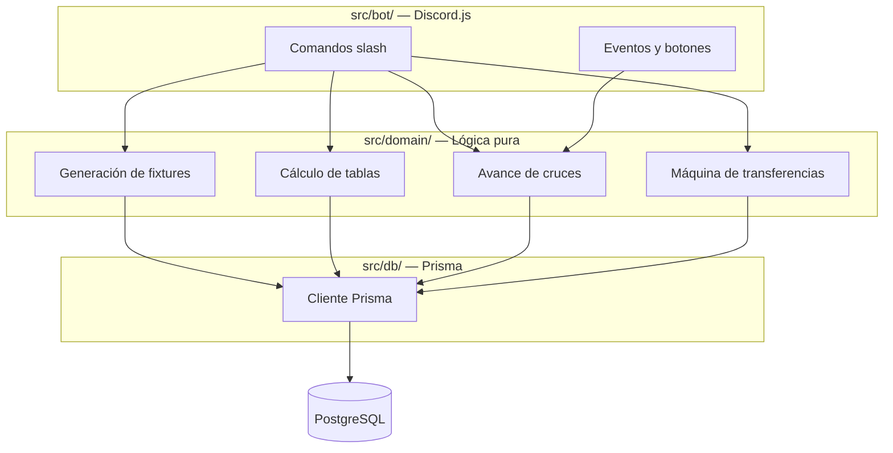
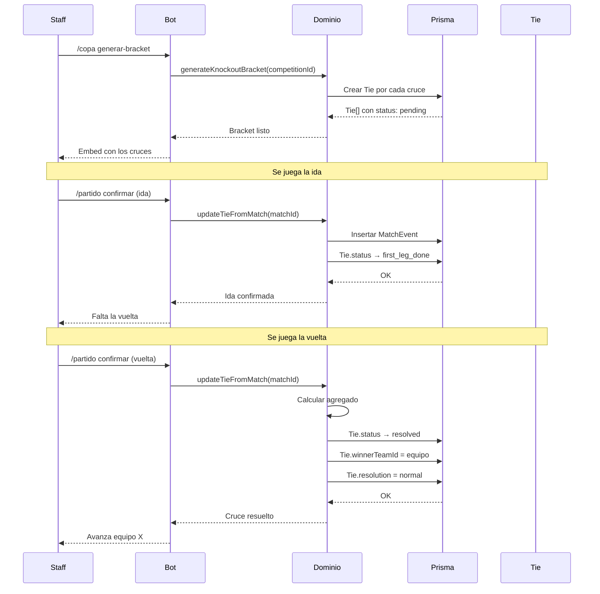
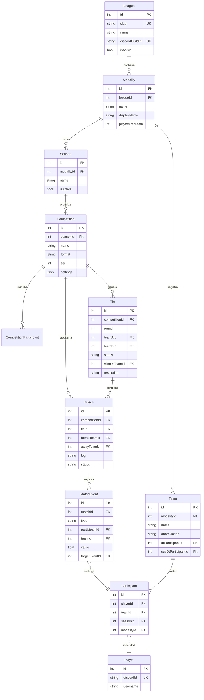

# AGON

<div align="center">

**ἀγών · el certamen**

*Plataforma para gestionar ligas de Haxball de principio a fin: inscripciones, plantillas, mercado de fichajes, competencias, brackets y estadísticas, desde un solo bot de Discord.*

[](https://www.typescriptlang.org/)
[](https://www.prisma.io/)
[](https://www.postgresql.org/)
[](https://discord.js.org/)
[](https://vitest.dev/)
[](LICENSE)

</div>

---

| Sección | Qué encuentras |
|---|---|
| [🏛️ Qué es AGON](#-qué-es-agon) | Descripción general y alcance del proyecto. |
| [🔧 Cómo funciona](#-cómo-funciona) | El bot, el dominio, el flujo completo. |
| [🧩 El problema que resuelve Tie](#-el-problema-que-resuelve-tie) | Los bugs de bracket y la solución estructural. |
| [📐 Arquitectura](#-arquitectura) | Diagrama de procesos y estructura de carpetas. |
| [🗄️ Modelo de datos](#-modelo-de-datos) | Diagrama entidad-relación y tabla de modelos. |
| [⚙️ Stack técnico](#-stack-técnico) | Tecnologías y por qué se eligieron. |
| [🧠 Principios de diseño](#-principios-de-diseño) | Las cinco reglas que guían el proyecto. |
| [📊 Estado del proyecto](#-estado-del-proyecto) | Qué está hecho y qué falta. |
| [🗺️ Roadmap](#-roadmap) | Próximos pasos en orden. |

---

## 🏛️ Qué es AGON

AGON es un sistema para administrar ligas de Haxball. Cubre el ciclo completo: inscripción de jugadores, formación de plantillas, ventanas de fichajes con ofertas y vencimientos, competencias en formato liga o copa, cruces de eliminatoria a ida y vuelta, carga de actas partido a partido y estadísticas históricas.

Está construido multi-liga desde el modelo. Hoy existe una sola liga, pero añadir una segunda el día de mañana es insertar una fila en la base de datos, no rediseñar el sistema. El bot resuelve a qué liga pertenece cada interacción mirando el ID del servidor de Discord, nunca una configuración fija.

Toma del fútbol real lo que ayuda a modelar una competencia —la separación entre club y plantilla, la convivencia de liga y copa en una misma temporada, el cruce a ida y vuelta como una unidad— y descarta lo que no aplica a una liga virtual. No hay estadios ni árbitros con carnet. La identidad del jugador vive en Discord.

> [!NOTE]
> El bot resuelve la liga por `interaction.guild.id` contra `League.discordGuildId`. Nunca hay una config fija con el ID de la liga. Sumar una segunda liga es insertar una fila e invitar el bot a ese servidor.

---

## 🔧 Cómo funciona

El bot de Discord es el único cliente. Los comandos de staff permiten configurar la liga, dar de alta equipos, abrir el mercado de fichajes, crear competencias y generar fixtures. Los comandos de jugadores y directores técnicos permiten consultar perfiles, tablas de posiciones, historial de carrera y estado de los cruces.

Toda la lógica de negocio vive en un módulo de dominio separado que no sabe que existe Discord. El bot llama a ese módulo directamente, en el mismo proceso, sin HTTP de por medio.



> [!TIP]
> El módulo `src/domain/` no importa `discord.js` en ningún archivo. Se puede testear sin levantar el bot, y el día que exista una web, bot y web compartirán el mismo cerebro.

---

## 🧩 El problema que resuelve Tie

En la versión anterior del sistema, el cruce de eliminatoria no existía como entidad. Se reconstruía al vuelo cada vez que alguien lo necesitaba, en tres lugares distintos del bot, y se calculaba mal las tres veces.

El bracket aparecía vacío al generarse porque la función que lo armaba leía partidos sueltos y no encontraba nada concreto que mostrar. La vuelta se creaba antes que la ida porque la pregunta "¿ya terminó la ida?" se respondía calculando sobre partidos sueltos cada vez, y se calculó mal la primera vez. El botón de plantilla mostraba la ronda equivocada porque esa misma pregunta se calculó por tercera vez con un criterio ligeramente distinto.

Tres síntomas, una misma causa: nadie era dueño del estado del cruce.

Con `Tie` como una fila real en la base de datos, ese estado vive en un solo lugar:

```
Tie
├── id
├── competitionId
├── round
├── teamAId, teamBId
├── status        → pending | first_leg_done | resolved
├── winnerTeamId
└── resolution    → normal | walkover | manual
```

El bracket, el anuncio del próximo partido y el avance de ronda consultan ese estado. No lo recalculan. La pregunta "¿qué toca ahora en este cruce?" pasa a ser una consulta:

```sql
SELECT * FROM ties
WHERE competition_id = ? AND status != 'resolved'
ORDER BY round
LIMIT 1;
```

El flujo completo de un cruce a ida y vuelta:



---

## 📐 Arquitectura

```
agon/
├── src/
│   ├── bot/       discord.js — comandos y eventos.
│   │              Lo único que sabe que existe Discord.
│   │
│   ├── domain/    Lógica pura: generación de fixtures,
│   │              cálculo de tablas, avance de cruces,
│   │              máquina de estados de transferencias.
│   │              Cero imports de discord.js.
│   │
│   └── db/        Cliente de Prisma y queries de lectura
│                  reutilizables.
│
├── prisma/
│   └── schema.prisma
│
├── tests/         Vitest sobre src/domain
└── package.json
```

Un solo proceso desplegado. El bot llama a `domain/` como funciones normales de TypeScript. No hay API HTTP intermedia porque no hace falta: el único cliente es el propio bot.

El día que exista una web con sesiones propias, hay dos caminos igual de válidos y ninguno obliga a rediseñar nada: añadir un puñado de rutas Fastify al mismo proceso reutilizando `src/domain/` tal cual, o levantar un segundo servicio — pero solo cuando haya un cliente real del otro lado.

---

## 🗄️ Modelo de datos

La jerarquía central del schema:



**League** es el techo. Lleva `slug` para la URL futura y `discordGuildId` para que el bot resuelva la liga por el servidor donde ocurre la interacción.

**Modality** es cada variante del juego —Futsal x4, Real Soccer— con sus propias reglas y canales de Discord. Cada modalidad tiene sus propias temporadas.

**Season** es la temporada. Una sola activa por modalidad a la vez, garantizado en la capa de dominio.

**Team** es el club, persistente entre temporadas. El DT y el Sub-DT son punteros directos a un `Participant`, no roles de Discord consultados en cada comando.

**Player** es la identidad. **Participant** es la ficha de esa identidad en una modalidad y temporada concreta. `Participant.teamId` es el puntero al equipo actual; la historia de altas y bajas vive en las ofertas de transferencia aceptadas.

**Competition** tiene un único campo `format` que distingue `round_robin` de `single_elimination`. El campo `tier` resuelve múltiples divisiones: dos competencias con el mismo formato y distinto tier son Primera y Segunda.

**Tie** es el cruce de eliminatoria. Agrupa uno o dos partidos —según la ronda sea a partido único o ida y vuelta— y lleva el estado del cruce, el ganador y la forma en que se resolvió.

**Match** es el partido. Ya no es dueño de quién ganó el cruce; eso lo decide el `Tie`.

**MatchEvent** es el acta. Inmutable. Corregir un gol no edita la fila original: inserta un evento nuevo de tipo `event_reverted` que apunta al evento que anula. La verdad histórica del partido nunca se sobrescribe.

> [!TIP]
> `Competition.settings` acepta un JSON con las reglas de esa competencia: wildcards, tiempo de espera, diferencia de goles para walkover, puntos por victoria. Si una liga usa 4 wildcards y otra usa 6, eso es una fila, no una constante en TypeScript.

<details>
<summary><strong>📋 Schema completo — los 20 modelos</strong></summary>

| Modelo | Propósito |
|---|---|
| `League` | Techo del sistema. `slug` + `discordGuildId`. |
| `Modality` | Variante del juego: Futsal x4, Real Soccer. |
| `Season` | Temporada. Una activa por modalidad. |
| `Team` | Club persistente. `dtParticipantId` y `subDtParticipantId` como FK. |
| `Player` | Identidad. `discordId` único. |
| `Participant` | Ficha del jugador en modalidad + temporada. |
| `Competition` | `format` (round_robin / single_elimination) + `tier`. |
| `CompetitionParticipant` | Inscripción de equipos. `group` + `seed`. |
| `Tie` | Cruce de eliminatoria. `status`, `winnerTeamId`, `resolution`. |
| `Match` | Partido. `leg`, `roundType`, `status`. |
| `MatchEvent` | Acta inmutable. `event_reverted` para correcciones. |
| `PlayerStatProjection` | Totales agregados. Se recalculan desde MatchEvent. |
| `ManualStatAdjustment` | Corrección manual: quién, cuánto, por qué. |
| `Award` | Premio de temporada o competencia. |
| `AwardWinner` | Ganador de un premio individual. |
| `CompetitionChampionRoster` | Snapshot del plantel campeón. |
| `TransferOffer` | Oferta de fichaje con máquina de estados. |
| `TransferOfferStatus` | pending / accepted / rejected / cancelled / expired. |
| `AuditLog` | Registro de mutaciones. `actorId`, `action`, `before/after`. |
| `Position` | Enum: GK, DEF, MID, DFWD, FWD, N/A. |

</details>

---

## ⚙️ Stack técnico

| Componente | Tecnología | Motivo |
|---|---|---|
| Base de datos | PostgreSQL gestionado (Supabase o Neon) | Motor robusto, capa gratuita suficiente para una liga. |
| ORM | Prisma | Tipado de extremo a extremo, migraciones versionadas. |
| Bot | discord.js | El cliente de Discord para Node.js. |
| Runtime | Node.js + TypeScript | Un solo lenguaje para dominio, bot y base de datos. |
| Tests | Vitest | Rápido, compatible con TypeScript sin configuración extra. |
| Hosting | VPS pequeño o host de bots | Un solo proceso Node. Sin Docker. |

> [!WARNING]
> La versión anterior del proyecto murió de peso: tres clientes imaginarios pidiendo autenticación JWT, un servicio de API separado y una capa de roles con alcance. Con un solo cliente real —el bot— nada de eso hace falta todavía. El día que exista una web con sesiones propias, esa infraestructura se ganará su lugar. No antes.

---

## 🧠 Principios de diseño

**Dominio separado de las integraciones.** La lógica de bracket, tabla y transferencias no sabe que existe Discord. Se puede probar sin levantar el bot. El día que haya web, bot y web compartirán el mismo cerebro en vez de reimplementar todo dos veces.

**Un solo punto de verdad por pregunta.** "¿Qué toca ahora en este cruce?" se responde en un solo lugar y todo lo demás lo consulta. El bug del bracket vacío, la vuelta antes que la ida y el botón con la ronda equivocada fueron tres síntomas de no tener esto.

**Reglas como datos, no como código.** Los wildcards, el tiempo de espera, la diferencia de goles para walkover y los criterios de desempate son configuración por competencia, no constantes en un archivo TypeScript ni párrafos fijos en una plantilla de anuncio.

**Diseñar para cambiar.** Ningún plan sobrevive al primer uso real. El propio `Tie` es el ejemplo: nadie lo vio venir hasta que una copa real lo necesitó y falló de tres formas distintas. Se construye lo que hace falta hoy, se dejan costuras baratas donde algo puede crecer, y se confía en que el resto se verá con uso real.

**Multi-tenant desde el modelo.** No es "si hay una segunda liga, agregamos un filtro por acá". Todo cuelga de `League` desde la primera tabla.

---

## 📊 Estado del proyecto

| Componente | Estado | Notas |
|---|---|---|
| Schema v1 | ✅ Completo | Modelo completo en Prisma: liga, modalidad, temporada, equipo, jugador, competencia, cruce, partido, evento, mercado y auditoría. |
| Dominio puro | ✅ Completo | Generación de fixtures round-robin y eliminatoria, cálculo de tablas, avance de cruces. Lógica probada. |
| Bot de Discord | ⏳ En desarrollo | Comandos de staff, jugadores y directores técnicos. Único cliente de esta versión. |
| Web | ⏸️ Pospuesta | El schema y el dominio puro ya la dejan fácil de sumar. Se construye cuando haya datos reales que mostrar. |

---

## 🗺️ Roadmap

- [x] Modelo de dominio completo en Prisma
- [x] Entidad `Tie` para cruces de eliminatoria
- [x] Eventos de partido inmutables con corrección vía `event_reverted`
- [x] Mercado de fichajes con máquina de estados
- [ ] Comandos base del bot (`/setup`, `/league-team`, `/league-competition`)
- [ ] Generación de fixtures desde el dominio
- [ ] Carga de actas y cálculo de tablas
- [ ] Avance de rondas en eliminatorias
- [ ] Premios y palmarés
- [ ] Web pública con datos de la liga

---

## 📄 Licencia

MIT.

<div align="center">

**AGON** · ἀγών

*Construido para durar, diseñado para cambiar.*

</div>