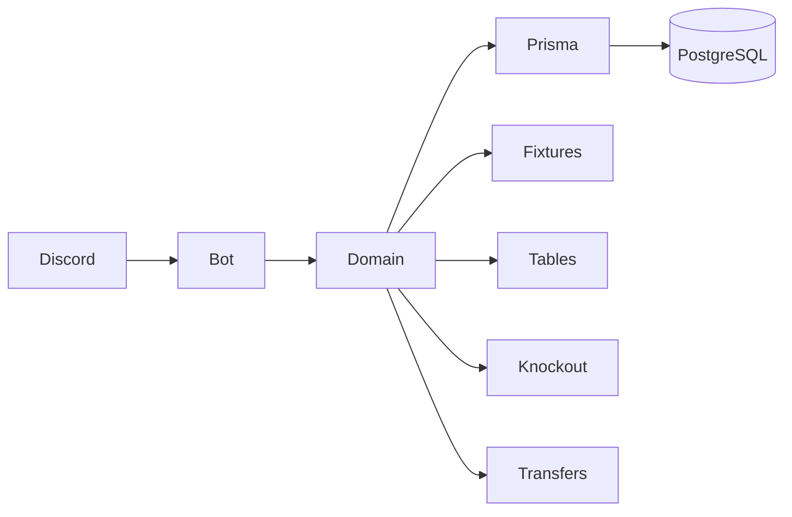

<a id="readme-top"></a>

<p align="center">
  
</p>

<p align="center">
  
</p>

<p align="center">
  
  
  
  
  
  
  
</p>

<br>

> **Construido para durar, diseñado para cambiar.**

AGON es un proyecto para llevar la administración de una liga de Haxball a un solo sistema:
jugadores, plantillas, fichajes, competencias, fixtures, eliminatorias, actas y estadísticas.

La idea no es hacer un bot lleno de comandos.

La idea es que **la liga tenga un modelo claro detrás**.

---

## 🏟️ La idea

Una liga virtual termina teniendo mucho más que partidos.

```text
Jugadores
    ↓
Plantillas
    ↓
Fichajes
    ↓
Competencias
    ↓
Fixtures
    ↓
Partidos
    ↓
Actas
    ↓
Estadísticas
    ↓
Historial
```

AGON se está diseñando para que todo eso pertenezca al mismo sistema y no a una colección de
datos, mensajes y cálculos separados.

Discord es el cliente previsto para esta primera etapa.

---

## 🧭 Diseñado alrededor de unas pocas ideas

<table>
  <tr>
    <td width="25%" align="center">
      <strong>🏛️ Multi-liga</strong><br>
      <sub>La liga es una entidad propia, separada del servidor de Discord.</sub>
    </td>
    <td width="25%" align="center">
      <strong>🧠 Dominio</strong><br>
      <sub>Las reglas importantes no dependen de Discord.</sub>
    </td>
    <td width="25%" align="center">
      <strong>⚔️ Tie</strong><br>
      <sub>Un cruce de eliminatoria tiene estado propio.</sub>
    </td>
    <td width="25%" align="center">
      <strong>📜 Historial</strong><br>
      <sub>Los hechos del partido se pueden reconstruir.</sub>
    </td>
  </tr>
</table>

---

## 🔧 Cómo encaja todo



El principio es sencillo:

> **Discord es la interfaz. El dominio es el cerebro.**

La lógica de fixtures, tablas, cruces y transferencias se plantea fuera de la capa del bot,
para poder probarla y reutilizarla sin depender de Discord.

---

## ⚔️ El problema de `Tie`

Una eliminatoria a ida y vuelta no son simplemente dos partidos.

Son un mismo enfrentamiento.

En sistemas anteriores, ese cruce se reconstruía a partir de partidos sueltos.
Ese enfoque terminaba haciendo que distintas partes del sistema interpretaran el estado de forma distinta.

AGON lo representa como una entidad propia:

```text
Tie
│
├── teamA
├── teamB
├── round
├── status
│   ├── pending
│   ├── first_leg_done
│   └── resolved
├── winnerTeamId
└── resolution
```

Así, preguntas como:

```text
¿ya terminó la ida?
¿qué toca ahora?
¿quién avanza?
```

tienen un lugar claro donde resolverse.

---

## 🏆 Competencias

El modelo parte de una idea simple:

```text
Competition
├── round_robin
└── single_elimination
```

y `tier` permite representar distintas divisiones sin crear un modelo nuevo solo para decir
"Primera", "Segunda", etc.

Las reglas propias de una competición pueden vivir en:

```text
Competition.settings
```

para evitar convertir reglas de una liga concreta en constantes desperdigadas por el código.

AGON toma del fútbol real lo que ayuda a representar una competición —club, temporada, liga,
copa, ida y vuelta— y adapta lo demás al mundo de Haxball.

---

## 👤 Jugador, equipo y temporada

La identidad del jugador y su participación no son la misma cosa:

```text
Player
   │
   └── Participant
          │
          ├── Season
          ├── Modality
          └── Team
```

Esto permite conservar la identidad del jugador mientras su contexto competitivo cambia entre temporadas.

---

## 📐 Modelo

La jerarquía central es:

```text
League
  └── Modality
       └── Season
            ├── Team
            │    └── Participant → Player
            │
            └── Competition
                 ├── Match
                 │    └── MatchEvent
                 └── Tie
                      └── Match
```

Entre las entidades del primer borrador están:

`League` · `Modality` · `Season` · `Team` · `Player` · `Participant`
· `Competition` · `CompetitionParticipant` · `Tie` · `Match` · `MatchEvent`
· `PlayerStatProjection` · `ManualStatAdjustment` · `Award` · `AwardWinner`
· `CompetitionChampionRoster` · `TransferOffer` · `AuditLog`

---

## 🧠 Algunas decisiones detrás del modelo

**Un punto de verdad por pregunta.**  
Si el sistema necesita saber qué sucede en un cruce, no debería calcularlo de tres maneras diferentes.

**Reglas como datos.**  
Una regla específica de una competición debería poder cambiar sin convertirla en una constante global.

**Eventos antes que sobrescrituras.**  
Una corrección de un evento no debería eliminar silenciosamente lo que ocurrió antes.

**Cambiar barato importa.**  
AGON no intenta adivinar todo lo que una liga podría necesitar dentro de cinco años.
Primero tiene que funcionar bien con una liga real.

---

## 📊 Estado actual

AGON está en **fase de diseño y primer borrador**.

Ahora mismo, el foco está en:

```text
✅ Modelo de dominio
✅ Schema Prisma v1
✅ Diseño de competencias y eliminatorias
✅ Entidad Tie
⬜ Implementación del bot
⬜ Fixtures en código
⬜ Actas y estadísticas
⬜ Operación de una liga real
```

No hay todavía una aplicación terminada detrás de este README.

Este repositorio está construyendo la base sobre la que llegará.

---

## 🗺️ Próximo paso

```text
Schema
  ↓
Dominio
  ↓
Tests
  ↓
Bot
  ↓
Primera liga funcionando
```

Después vendrán las cosas que realmente merezcan ser agregadas.

---

## ⚙️ Stack

<p align="center">
  
</p>

| Parte         | Tecnología |
| ------------- | ---------- |
| Lenguaje      | TypeScript |
| Runtime       | Node.js    |
| Bot           | discord.js |
| ORM           | Prisma     |
| Base de datos | PostgreSQL |
| Tests         | Vitest     |

---

## 🤍

AGON nace para una comunidad que durante años ha tenido que resolver la administración de sus ligas
con herramientas que no fueron hechas específicamente para ello.

Esta es una forma de intentar hacerlo mejor.

<br>

<p align="center">
  <sub>Hecho con ❤️ para la comunidad de Haxball</sub>
</p>

<p align="center">
  <sub>agon · el certamen</sub>
</p>

<p align="center">
  <a href="#readme-top">↑ volver arriba</a>
</p>
