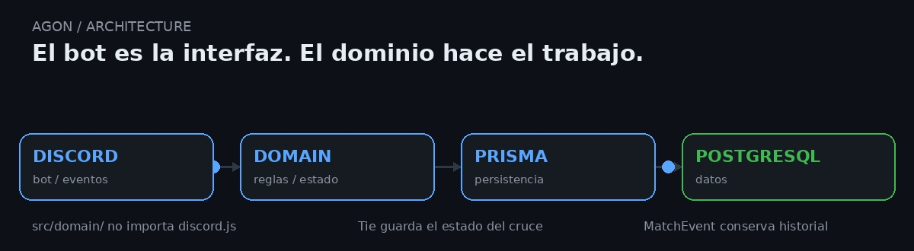
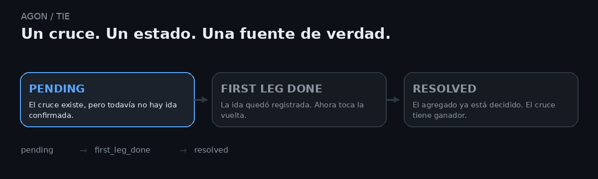
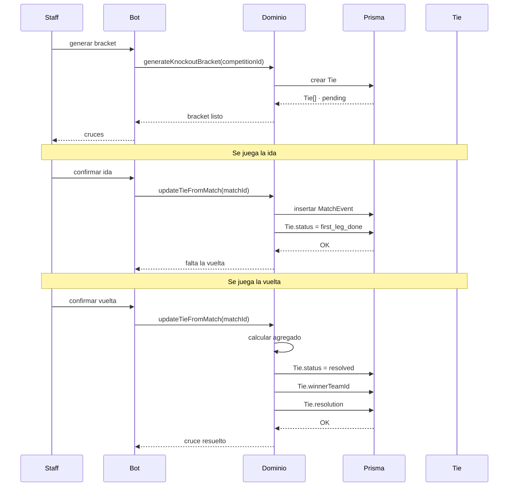

<a id="readme-top"></a>

<p align="center">
  
</p>

<p align="center">
  
</p>

<p align="center">
  
</p>

<p align="center">
  
  
  
  
</p>

<p align="center">
  
  
  
</p>

<br>

> **Construido para durar, diseñado para cambiar.**

AGON nace de una necesidad bastante concreta: administrar una liga de Haxball sin tener la misma
información repartida entre comandos, mensajes, hojas y cálculos distintos.

Inscripciones, plantillas, fichajes, competencias, brackets, actas y estadísticas viven dentro del
mismo sistema.

Hoy el cliente es un bot de Discord. El resto está pensado para que no tenga que quedarse ahí.

<p align="center">
  
</p>

<p align="center">
  <sub>Discord → dominio → persistencia. Sin una segunda implementación de las reglas.</sub>
</p>

---

## ⚡ Lo importante

<table align="center">
  <tr>
    <td align="center" width="25%">
      <strong>🏛️ Multi-liga</strong><br>
      <sub>La liga se resuelve por <code>interaction.guild.id</code>.</sub>
    </td>
    <td align="center" width="25%">
      <strong>🧠 Dominio separado</strong><br>
      <sub><code>src/domain/</code> no conoce Discord.</sub>
    </td>
    <td align="center" width="25%">
      <strong>⚔️ Cruces con estado</strong><br>
      <sub><code>Tie</code> es el dueño del enfrentamiento.</sub>
    </td>
    <td align="center" width="25%">
      <strong>📜 Actas inmutables</strong><br>
      <sub>Las correcciones no borran historia.</sub>
    </td>
  </tr>
</table>

<br>

<details>
<summary><strong>📖 Tabla de contenidos</strong></summary>

<br>

- [🏛️ Qué es AGON](#️-qué-es-agon)
- [🎯 Qué cubre](#-qué-cubre)
- [🔄 Cómo funciona](#-cómo-funciona)
- [⚔️ El problema de Tie](#️-el-problema-de-tie)
- [📐 Arquitectura](#-arquitectura)
- [🗄️ Modelo de datos](#️-modelo-de-datos)
- [⚙️ Stack técnico](#️-stack-técnico)
- [🧠 Principios de diseño](#-principios-de-diseño)
- [📊 Estado del proyecto](#-estado-del-proyecto)
- [🗺️ Roadmap](#️-roadmap)
- [🚀 Desarrollo local](#-desarrollo-local)
- [📄 Licencia](#-licencia)

</details>

---

## 🏛️ Qué es AGON

AGON es un sistema para administrar ligas de Haxball. Cubre el ciclo completo: inscripción de jugadores,
formación de plantillas, ventanas de fichajes con ofertas y vencimientos, competencias en formato liga
o copa, cruces de eliminatoria a ida y vuelta, carga de actas partido a partido y estadísticas históricas.

Está construido **multi-liga desde el modelo**. Hoy existe una sola liga, pero una segunda no requiere
duplicar el sistema: basta con registrar otra liga y asociar el bot al servidor correspondiente.

La identidad del jugador vive en Discord.

AGON toma del fútbol real las ideas que ayudan a representar una competición —club, plantilla,
temporada, liga, copa, ida y vuelta— y deja fuera lo que no tiene sentido aquí.

No hay estadios ni árbitros con carnet.

---

## 🎯 Qué cubre

<table>
  <tr>
    <td width="33%" align="center">
      <strong>👤 Jugadores</strong><br>
      <sub>Inscripción, perfiles, plantillas y participación por temporada.</sub>
    </td>
    <td width="33%" align="center">
      <strong>🔁 Mercado</strong><br>
      <sub>Ofertas, vencimientos y cambios de equipo con estado persistente.</sub>
    </td>
    <td width="33%" align="center">
      <strong>🏆 Competencias</strong><br>
      <sub>Ligas, copas, divisiones, grupos y seeds.</sub>
    </td>
  </tr>
  <tr>
    <td width="33%" align="center">
      <strong>📅 Fixtures</strong><br>
      <sub>Generación de jornadas y partidos desde el dominio.</sub>
    </td>
    <td width="33%" align="center">
      <strong>⚔️ Eliminatorias</strong><br>
      <sub>Cruces, ida y vuelta, ganador y resolución.</sub>
    </td>
    <td width="33%" align="center">
      <strong>📊 Estadísticas</strong><br>
      <sub>Actas, proyecciones, ajustes, premios e historial.</sub>
    </td>
  </tr>
</table>

---

## 🔄 Cómo funciona

El bot de Discord es el único cliente de esta versión.

Los comandos de staff configuran la liga, equipos, mercado y competencias.
Los comandos de jugadores y directores técnicos sirven para consultar perfiles, tablas,
historial y estado de los cruces.

La lógica de negocio vive aparte:

```text
src/bot/      → Discord.js
      │
      ▼
src/domain/   → reglas de la competición
      │
      ▼
src/db/       → Prisma
      │
      ▼
PostgreSQL
```

El bot llama al dominio directamente, dentro del mismo proceso.

No hay HTTP de por medio porque hoy no hace falta.

> [!TIP]
> El módulo `src/domain/` no importa `discord.js`. Se puede probar sin levantar el bot y,
> cuando exista otro cliente, ese cliente puede utilizar las mismas reglas.

### Una liga, resuelta por el servidor

La liga no está fijada en un `config.ts`.

El bot mira:

```ts
interaction.guild.id
        ↓
League.discordGuildId
        ↓
liga correspondiente
```

Eso permite que el mismo código pueda trabajar con más de una liga sin cambiar su lógica.

---

## ⚔️ El problema de Tie

Esta parte existe porque antes el sistema fallaba exactamente aquí.

El cruce de eliminatoria no era una entidad real.
Se reconstruía desde partidos sueltos cada vez que alguna parte del bot necesitaba saber qué estaba pasando.

Eso acabó produciendo:

```text
BRACKET VACÍO
    ↓
la generación no encontraba un cruce concreto

VUELTA ANTES QUE IDA
    ↓
"¿terminó la ida?" se volvía a calcular

RONDA EQUIVOCADA
    ↓
otra parte interpretaba los mismos partidos de otra forma
```

Tres síntomas.

Una causa:

> **nadie era dueño del estado del cruce.**

La solución fue convertir `Tie` en una fila real de la base de datos.

```text
Tie
│
├── id
├── competitionId
├── round
├── teamAId
├── teamBId
│
├── status
│   ├── pending
│   ├── first_leg_done
│   └── resolved
│
├── winnerTeamId
└── resolution
    ├── normal
    ├── walkover
    └── manual
```

<p align="center">
  
</p>

<p align="center">
  <sub><code>pending</code> → <code>first_leg_done</code> → <code>resolved</code></sub>
</p>

A partir de ahí, el bracket, el siguiente partido y el avance de ronda consultan el mismo estado.

Ya no lo recalculan cada uno por su cuenta.

### El ciclo de un cruce



> [!IMPORTANT]
> `Match` representa el partido.
> `Tie` representa el enfrentamiento.
> El partido registra lo que pasó; el cruce decide quién sigue.

---

## 📐 Arquitectura

La estructura actual está pensada alrededor de tres responsabilidades claras:

```text
agon/
│
├── src/
│   ├── bot/       Discord.js — comandos y eventos
│   │
│   ├── domain/    lógica pura
│   │              ├── fixtures
│   │              ├── tablas
│   │              ├── cruces
│   │              └── transferencias
│   │
│   └── db/        Prisma y queries de lectura reutilizables
│
├── prisma/
│   └── schema.prisma
│
├── tests/
│   └── Vitest sobre src/domain
│
└── package.json
```

El principio es sencillo:

```text
        DISCORD
           │
           ▼
        DOMAIN
           │
           ▼
        PRISMA
           │
           ▼
      POSTGRESQL
```

Un solo proceso.

Sin microservicios porque, por ahora, no hay un segundo cliente que los justifique.

### ¿Y una web?

La arquitectura no la bloquea.

Cuando exista una web con sesiones propias hay dos caminos razonables:

```text
Opción A
Discord ─────┐
             ├── src/domain/ ─── PostgreSQL
Web ─────────┘

Opción B

Discord ─── src/domain/
Web ─────── API ───── src/domain/
```

La decisión se toma cuando exista realmente ese segundo cliente.

No antes.

> [!IMPORTANT]
> La versión anterior comenzó por autenticación multi-cliente, API separada y otras piezas
> de infraestructura antes de tener una feature visible. AGON cambia el orden:
> **modelo → dominio → cliente real → infraestructura adicional cuando haga falta.**

---

## 🗄️ Modelo de datos

La jerarquía central del sistema es:


### Entidades

| Modelo | Propósito |
|---|---|
| `League` | Techo del sistema. `slug` + `discordGuildId`. |
| `Modality` | Variante del juego: Futsal x4, Real Soccer. |
| `Season` | Temporada. Una activa por modalidad. |
| `Team` | Club persistente entre temporadas. |
| `Player` | Identidad. `discordId` único. |
| `Participant` | Ficha de la identidad en modalidad + temporada. |
| `Competition` | Competencia; `format` y `tier` distinguen su estructura. |
| `CompetitionParticipant` | Equipos inscritos, grupo y seed. |
| `Tie` | Cruce de eliminatoria y su estado. |
| `Match` | Partido individual. |
| `MatchEvent` | Acta inmutable. |
| `PlayerStatProjection` | Totales agregados desde los eventos. |
| `ManualStatAdjustment` | Corrección manual con responsable y motivo. |
| `Award` | Premio de temporada o competencia. |
| `AwardWinner` | Ganador de un premio individual. |
| `CompetitionChampionRoster` | Snapshot del plantel campeón. |
| `TransferOffer` | Oferta de fichaje. |
| `TransferOfferStatus` | `pending / accepted / rejected / cancelled / expired`. |
| `AuditLog` | Registro de mutaciones: actor, acción, antes/después. |
| `Position` | `GK / DEF / MID / DFWD / FWD / N/A`. |

<details>
<summary><strong>👤 Player vs Participant</strong></summary>

<br>

`Player` es la identidad.

`Participant` es esa identidad dentro de una modalidad y temporada concreta.

```text
Player
  │
  ├── Season A → Participant → Team X
  │
  └── Season B → Participant → Team Y
```

Así la historia competitiva no depende de sobrescribir al jugador original.

</details>

<details>
<summary><strong>📜 MatchEvent es inmutable</strong></summary>

<br>

Corregir un gol no significa borrar la fila original.

La corrección se registra como un nuevo evento:

```text
event_reverted → targetEventId
```

De esa forma, el acta original sigue formando parte de la historia y el estado actual puede reconstruirse.

</details>

<details>
<summary><strong>⚙️ Las reglas de Competition.settings</strong></summary>

<br>

Las reglas propias de una competición viven como datos:

```text
wildcards
tiempo de espera
diferencia para walkover
puntos
criterios de desempate
```

Si una competición necesita una regla diferente, no hace falta convertirla en una constante global del bot.

</details>

---

## 🧩 Un detalle importante del modelo

AGON intenta distinguir cosas que en un bot pequeño suelen terminar mezcladas:

```text
PLAYER
  │
  ▼
PARTICIPANT
  │
  ▼
TEAM
  │
  ▼
SEASON
  │
  ▼
COMPETITION
  │
  ├── MATCH
  │     └── MATCHEVENT
  │
  └── TIE
        └── MATCH
```

`Team` es el club.

`Participant` es la participación histórica de un jugador.

`Match` es una unidad jugable.

`Tie` es la unidad competitiva del cruce.

`MatchEvent` es lo que ocurrió dentro del partido.

Separarlos hace que las reglas tengan un lugar bastante más claro.

---

## ⚙️ Stack técnico

<p align="center">
  
</p>

| Componente | Tecnología | Motivo |
|---|---|---|
| Lenguaje | TypeScript | Un solo lenguaje para dominio, bot y acceso a datos. |
| Runtime | Node.js | Un solo proceso para esta versión. |
| Bot | discord.js | Cliente actual de Discord. |
| ORM | Prisma | Tipado, schema y migraciones versionadas. |
| Base de datos | PostgreSQL | Persistencia principal. |
| Tests | Vitest | Pruebas sobre el dominio sin levantar Discord. |
| Hosting | VPS pequeño / host de bots | Un proceso Node, sin Docker por ahora. |

---

## 🧠 Principios de diseño

**Dominio separado de las integraciones.**

La lógica de brackets, tablas y transferencias no debería saber que existe Discord.

**Una pregunta, un dueño.**

Si varias partes necesitan saber qué ocurre en un cruce, no deberían resolverlo de tres maneras diferentes.

**Reglas como datos.**

Las reglas que pertenecen a una competición deberían poder vivir en la competición.

**Historia sin sobrescritura.**

Lo que ocurrió en un partido debe poder reconstruirse.

**Multi-liga desde el modelo.**

`League` está arriba desde el principio; no se agrega después como un parche.

**Diseñar para cambiar.**

El propio `Tie` es el ejemplo: no apareció porque quedara bonito en el schema.
Apareció porque una copa real necesitó un dueño para su estado.

---

## 📊 Estado del proyecto

| Componente | Estado | Notas |
|---|:---:|---|
| Schema v1 | ✅ Completo | Liga, modalidad, temporada, equipo, jugador, competencia, cruce, partido, eventos, mercado y auditoría. |
| Dominio puro | ✅ Completo | Fixtures round-robin y eliminatoria, tablas y avance de cruces. |
| Entidad `Tie` | ✅ Completa | Estado explícito del cruce. |
| Eventos inmutables | ✅ Completo | Correcciones mediante `event_reverted`. |
| Mercado | ✅ Completo | Máquina de estados de transferencias. |
| Bot de Discord | 🟡 En desarrollo | Comandos de staff, jugadores y directores técnicos. |
| Web | ⏸️ Pospuesta | Se construye cuando haya datos reales que mostrar. |

> [!NOTE]
> El proyecto sigue en fase de diseño y primeros borradores.
> El schema de datos está completo y validado; el siguiente paso es convertir ese modelo en el primer corte operativo del bot.

---

## 🗺️ Roadmap

```text
FOUNDATION
├── [x] Modelo de dominio completo en Prisma
├── [x] Entidad Tie
├── [x] Eventos de partido inmutables
└── [x] Mercado de fichajes con máquina de estados

BOT
├── [ ] /setup
├── [ ] /league-team
├── [ ] /league-competition
├── [ ] Generación de fixtures
├── [ ] Carga de actas
└── [ ] Cálculo de tablas

COMPETITION
├── [ ] Avance de rondas
├── [ ] Premios y palmarés
└── [ ] Más herramientas de competición

FUTURE
└── [ ] Web pública con datos de la liga
```

---

## 🚀 Desarrollo local

```bash
git clone https://github.com/Kevris/AGON.git
cd AGON
npm install
```

Después, configura las variables de entorno y la conexión de Prisma/PostgreSQL según tu entorno local.

Los comandos exactos de ejecución dependen del `package.json` de la versión que se esté trabajando.

---

## 🧭 Algunas decisiones que pueden cambiar

<details>
<summary><strong>¿Por qué un solo proceso?</strong></summary>

<br>

Porque hoy el único cliente real es el bot.

Separarlo en servicios ahora añadiría contratos y despliegues sin una necesidad concreta.

</details>

<details>
<summary><strong>¿Por qué no una API todavía?</strong></summary>

<br>

Porque Discord puede llamar directamente al dominio.

Una API empieza a tener sentido cuando exista otro cliente que realmente necesite consumirlo.

</details>

<details>
<summary><strong>¿Por qué no empezar por autenticación?</strong></summary>

<br>

Porque la versión anterior empezó a construir infraestructura para clientes que todavía no existían.

Aquí el orden es otro:

```text
modelo
  ↓
dominio
  ↓
cliente real
  ↓
infraestructura cuando haga falta
```

</details>

---

## 📄 Licencia

MIT.

<br>

<p align="center">
  <sub>Hecho con ❤️ para la comunidad de Haxball</sub>
</p>

<p align="center">
  <sub>Build it. Break it. Understand it. Make it better.</sub>
</p>

<p align="center">
  <a href="https://github.com/Kevris/AGON">
    
  </a>
</p>

<p align="center">
  <a href="#readme-top">↑ volver arriba</a>
</p>

<p align="center">
  
</p>
