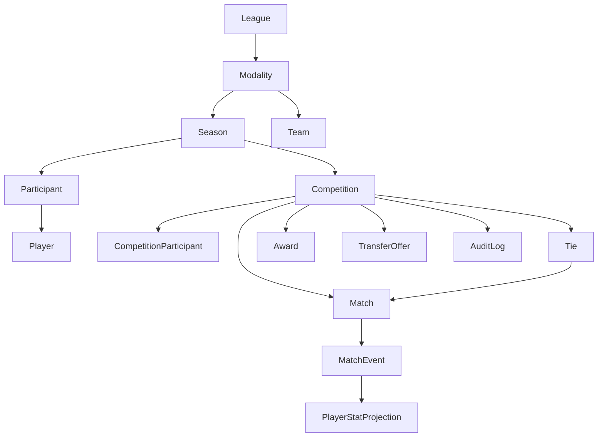
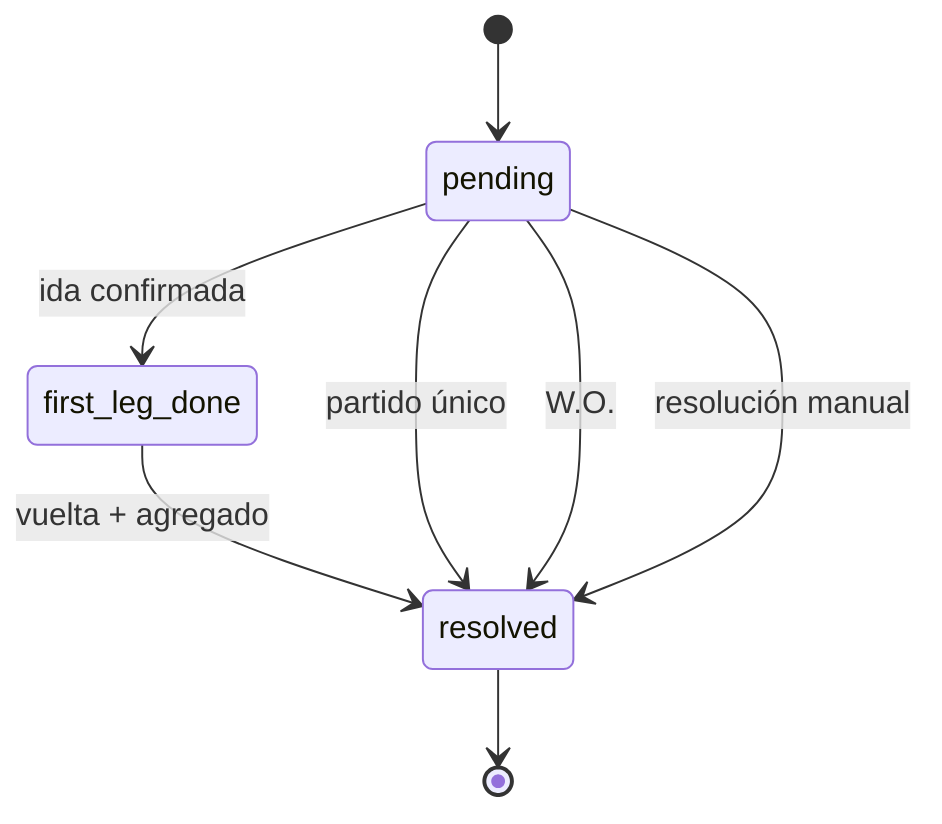

<a id="readme-top"></a>

<p align="center">
  
</p>

<p align="center">
  
</p>

<p align="center">
  
  
  
  
  
  
</p>

<br>

> AGON es el borrador de un sistema para administrar ligas de Haxball desde Discord.

Todavía no es un producto terminado.

En esta etapa hay dos cosas: **una dirección clara para el sistema y un primer schema de dominio**.

La idea es sencilla: que una liga no dependa de información repetida entre comandos, mensajes y cálculos distintos.

---

## 🏟️ La idea

Una liga virtual termina acumulando bastante más que partidos:

```text
Jugadores
   ↓
Plantillas
   ↓
Fichajes
   ↓
Competencias
   ↓
Fixtures
   ↓
Partidos
   ↓
Actas
   ↓
Estadísticas
   ↓
Historial
```

AGON intenta que todo eso forme parte del mismo modelo.

Discord sería la interfaz.

La lógica de la competición vive aparte.

La base de datos guarda el estado.

---

## 🧭 El modelo, en una mirada



La jerarquía empieza arriba y baja hasta lo que ocurre dentro de un partido.

Eso permite separar cosas que suelen terminar mezcladas en sistemas pequeños:

| Concepto | Qué representa |
|---|---|
| `Player` | La identidad del jugador. |
| `Participant` | Esa identidad dentro de una temporada y modalidad. |
| `Team` | El club. |
| `Competition` | Una liga o copa concreta. |
| `Match` | Un partido. |
| `MatchEvent` | Lo que ocurrió dentro del partido. |
| `Tie` | El cruce completo de una eliminatoria. |

---

## ⚔️ El detalle que más importa: `Tie`

El problema más claro que intenta resolver AGON está en las eliminatorias.

Un octavo de final a ida y vuelta no son simplemente "dos partidos".

Son **un mismo enfrentamiento compuesto por dos partidos**.

Por eso `Tie` existe como entidad propia:

```text
Tie
│
├── teamA
├── teamB
├── round
│
├── pending
│
├── first_leg_done
│
└── resolved
        └── winnerTeamId
```

El schema actual lo define precisamente para responder preguntas como:

```text
¿ya se puede crear la vuelta?
¿qué toca anunciar?
¿quién avanza?
```

en un solo lugar, en vez de reconstruir la respuesta a partir de varios `Match`.

### Ciclo



Esta es probablemente la decisión de modelo más importante de esta primera versión.

---

## 📜 El partido no es el historial

`Match` contiene el partido.

`MatchEvent` contiene los hechos.

```text
Match
  │
  └── MatchEvent[]
        │
        ├── goal
        ├── assist
        ├── own_goal
        ├── clean_sheet
        ├── mvp
        └── event_reverted
```

La intención es que los eventos sean **inmutables**.

Si un evento necesita corregirse, no se borra silenciosamente.

Se añade un `event_reverted` que apunta al evento original.

Así el historial puede reconstruirse.

---

## 👤 Player ≠ Participant

Un jugador puede existir durante muchas temporadas.

La identidad es una cosa.

Su participación en una competición es otra.

```text
Player
  │
  ├── Season 2026
  │      └── Participant → Team A
  │
  └── Season 2027
         └── Participant → Team B
```

En el schema, `Participant` lleva el contexto de:

```text
player
season
modality
team
position
```

Eso evita convertir a `Player` en una copia del estado actual del jugador.

---

## 🏆 Competencias

El primer borrador mantiene dos formatos:

```text
round_robin
single_elimination
```

y utiliza `tier` para poder tener, por ejemplo:

```text
Primera
Segunda
Tercera
```

sin crear un modelo `Division` separado.

Las reglas particulares de una competición pueden vivir en:

```text
Competition.settings
```

La intención es que reglas como:

```text
wildcards
puntos
tiempo de espera
walkover
criterios de desempate
```

no terminen convertidas en constantes globales del bot.

> La idea de `settings` está para reglas propias de una competencia concreta, no para meter absolutamente todo en JSON.

---

## 🌎 Multi-liga

No es la prioridad de esta primera etapa.

Sí es una dirección real del proyecto.

El modelo parte de:

```text
League
  └── Modality
       └── Season
            └── Competition
```

y `League` ya contempla:

```text
slug
discordGuildId
```

Eso permite que, más adelante, AGON pueda alojar ligas distintas bajo el mismo sistema.

Ejemplo:

```text
agon/haxven
agon/haxcol
agon/...
```

Pero primero tiene que funcionar bien una liga.

---

## 🧱 Arquitectura pensada para ahora

No hay intención de empezar con tres servicios, JWT, API separada y una infraestructura enorme.

La primera versión apunta a algo bastante más directo:

```text
Discord
   │
   ▼
src/bot
   │
   ▼
src/domain
   │
   ▼
Prisma
   │
   ▼
PostgreSQL
```

`src/domain` no debería depender de `discord.js`.

La idea es que las reglas importantes puedan probarse sin levantar Discord y que, llegado el momento,
otro cliente pueda reutilizarlas.

---

## 🧠 Qué se quiere evitar

AGON parte de una idea bastante simple:

> **No construir infraestructura para problemas que todavía no existen.**

Por eso, en esta etapa:

```text
❌ App de árbitros
❌ Auth multi-cliente
❌ JWT
❌ API separada
❌ PostgREST operado aparte
❌ Microservicios
❌ Stage para torneos híbridos
```

y sí:

```text
✅ Modelo de dominio
✅ Competencias
✅ Tie
✅ Partidos
✅ Eventos
✅ Transferencias
✅ Estadísticas
✅ Auditoría
✅ Tests del dominio
```

El día que aparezca una necesidad real, se agrega.

---

## 🗃️ Qué existe ahora mismo

Este proyecto está **en planificación / primer borrador**.

La base actual es:

```text
agon/
├── agon-schema-v1-draft.prisma
└── x.txt
```

El archivo Prisma contiene el primer modelo del sistema:

```text
League
Modality
Season
Team
Player
Participant
Competition
CompetitionParticipant
Tie
Match
MatchEvent
PlayerStatProjection
ManualStatAdjustment
Award
AwardWinner
CompetitionChampionRoster
TransferOffer
AuditLog
```

No hay todavía un bot funcional que presentar aquí.

No hay una API que levantar.

No hay una web que enseñar.

Y está bien.

El objetivo de esta etapa es que **cuando empiece a escribirse el código, el código tenga dónde caer**.

---

## 🗺️ Próximo paso

El orden previsto es pequeño:

```text
1. Revisar el schema campo por campo
          ↓
2. Adaptar / validar la lógica de fixtures
          ↓
3. Implementar el dominio
          ↓
4. Añadir tests
          ↓
5. Empezar los comandos del bot
```

Primero una base que aguante.

Después, el resto.

---

## 🛠️ Stack previsto

<p align="center">
  
</p>

| Parte | Tecnología |
|---|---|
| Lenguaje | TypeScript |
| Runtime | Node.js |
| Bot | discord.js |
| ORM | Prisma |
| Base de datos | PostgreSQL |
| Tests | Vitest |

---

## ✦

AGON no intenta ser una plataforma enorme desde el primer commit.

La idea es otra:

**hacer bien la primera liga, aprender de ella y dejar el modelo preparado para lo que venga después.**

<br>

<p align="center">
  <sub>Hecho con ❤️ para la comunidad de Haxball</sub>
</p>

<p align="center">
  <sub>agon · el certamen</sub>
</p>

<p align="center">
  <a href="#readme-top">↑ volver arriba</a>
</p>
