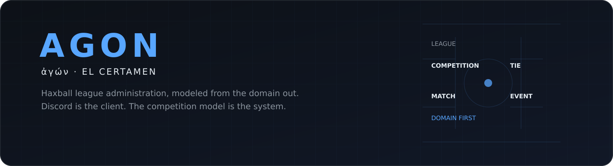
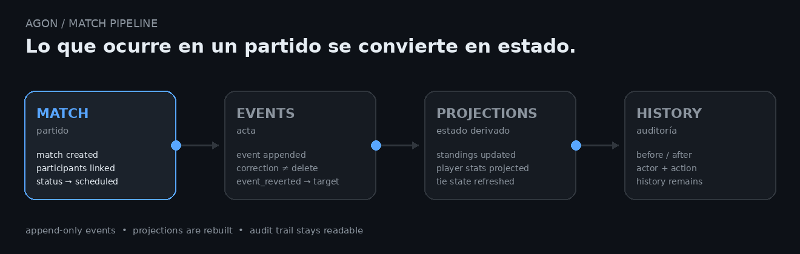
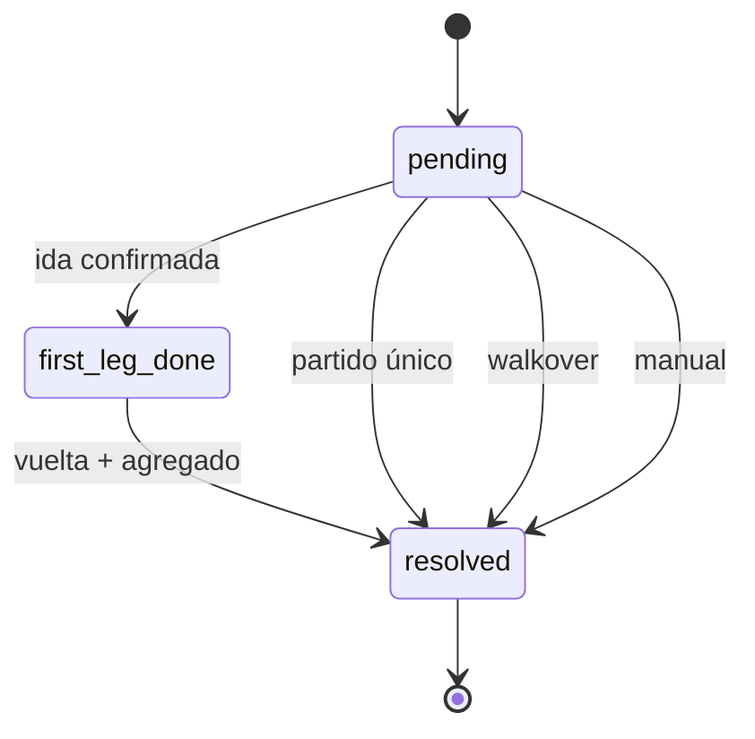
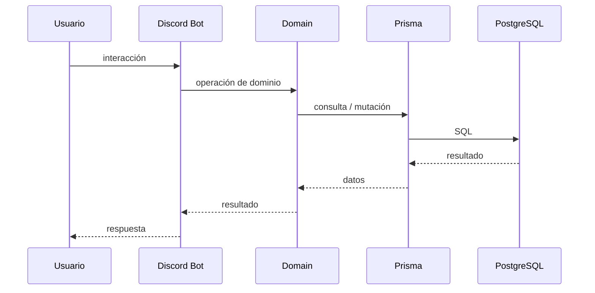
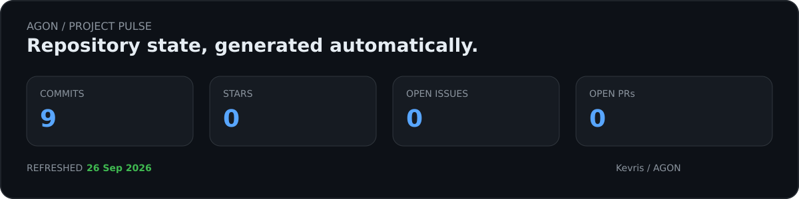

<a id="readme-top"></a>

<p align="center">
  <picture>
    <source media="(prefers-color-scheme: dark)" srcset="assets/agon-hero-dark.svg">
    <source media="(prefers-color-scheme: light)" srcset="assets/agon-hero-light.svg">
    
  </picture>
</p>

<p align="center">
  
</p>

<p align="center">
  <a href="https://agon-sooty-two.vercel.app/">
    
  </a>
  <a href="https://github.com/Kevris/AGON/actions/workflows/readme-assets.yml">
    
  </a>
  
</p>

<p align="center">
  
</p>

---

> **Construido para durar, diseñado para cambiar.**

AGON existe para resolver una cosa bastante concreta:

**administrar una liga de Haxball sin tener que reconstruir su estado cada vez que alguien pregunta qué está pasando.**

Jugadores, plantillas, fichajes, competencias, fixtures, cruces, actas y estadísticas forman parte del mismo modelo.

Hoy Discord es la interfaz.

El dominio es el sistema.

---

## 🧭 AGON en 30 segundos

```text
                         LEAGUE
                            │
                         MODALITY
                            │
                          SEASON
                     ┌──────┴──────┐
                    TEAM       COMPETITION
                     │          ┌───┴────┐
               PARTICIPANT    MATCH    TIE
                     │          │        │
                   PLAYER    MATCHEVENT  MATCH
                                  │
                           STAT PROJECTION
```

La separación importa porque cada objeto responde una pregunta distinta.

| Pregunta | Dueño |
|---|---|
| ¿Qué liga está usando este servidor? | `League.discordGuildId` |
| ¿En qué equipo participa este jugador esta temporada? | `Participant` |
| ¿Qué partido ocurrió? | `Match` |
| ¿Qué pasó dentro del partido? | `MatchEvent` |
| ¿Qué toca ahora en el cruce? | `Tie` |
| ¿Qué estadísticas se derivan del acta? | `PlayerStatProjection` |

---

## ⚡ Lo que hace

<table align="center">
  <tr>
    <td align="center" width="33%">
      <strong>👤 Jugadores</strong><br>
      <sub>Inscripción, perfiles y participación histórica.</sub>
    </td>
    <td align="center" width="33%">
      <strong>🔁 Fichajes</strong><br>
      <sub>Ofertas, vencimientos y estados persistentes.</sub>
    </td>
    <td align="center" width="33%">
      <strong>🏆 Competencias</strong><br>
      <sub>Ligas, copas, divisiones, grupos y seeds.</sub>
    </td>
  </tr>
  <tr>
    <td align="center">
      <strong>📅 Fixtures</strong><br>
      <sub>Generación desde el dominio.</sub>
    </td>
    <td align="center">
      <strong>⚔️ Eliminatorias</strong><br>
      <sub>Partido único o ida y vuelta.</sub>
    </td>
    <td align="center">
      <strong>📊 Historial</strong><br>
      <sub>Actas, estadísticas, premios y auditoría.</sub>
    </td>
  </tr>
</table>

---

## 🧬 La parte que importa

Hay tres decisiones que terminan explicando casi todo AGON.

### 01 · Discord no es el dominio

```text
Discord
   │
   ▼
src/bot/
   │
   ▼
src/domain/
   │
   ▼
src/db/
   │
   ▼
PostgreSQL
```

`src/domain/` no importa `discord.js`.

El bot es una interfaz que llama al dominio dentro del mismo proceso.

Eso deja la puerta abierta a otro cliente sin tener que duplicar las reglas.

---

### 02 · Un `Tie` tiene que ser una cosa real

Antes, el cruce de una eliminatoria se reconstruía a partir de partidos.

Eso produjo tres problemas:

```text
bracket vacío
     ↓
vuelta antes que ida
     ↓
ronda equivocada
```

No eran tres problemas distintos.

El problema era que **nadie era dueño del estado del cruce**.

Ahora:

```text
Tie
├── round
├── teamAId
├── teamBId
├── status
├── winnerTeamId
└── resolution
```

y el estado puede ser:

```text
pending
   ↓
first_leg_done
   ↓
resolved
```

<p align="center">
  
</p>

<p align="center">
  <sub>Un partido produce eventos; los eventos alimentan el estado que el resto del sistema consulta.</sub>
</p>

---

### 03 · Corregir no significa borrar

`MatchEvent` es el acta.

Cuando algo debe corregirse, la fila original no desaparece.

```text
event #41
   │
   └── event_reverted → targetEventId: 41
```

Así el historial sigue siendo reconstruible y la corrección queda registrada.

---

## ⚔️ El ciclo de un cruce



La pregunta:

> **"¿Qué toca ahora?"**

no se responde mirando tres tablas y esperando que coincidan.

Se consulta `Tie`.

---

## 🔌 Cómo una interacción llega al dato



No hay HTTP entre el bot y el dominio.

Por ahora tampoco hace falta.

---

## 🖥️ El proyecto también tiene una consola

Esto no intenta simular el bot.

Es una forma visual de enseñar el modelo y las transiciones que hacen interesante a AGON.

<p align="center">
  
</p>

<p align="center">
  <sub>Generado desde <code>terminal.yml</code> mediante GitHub Actions.</sub>
</p>

---

## 📐 Modelo de datos


### Entidades principales

| Modelo | Responsabilidad |
|---|---|
| `League` | Liga y vínculo con el servidor de Discord. |
| `Modality` | Variante del juego. |
| `Season` | Temporada por modalidad. |
| `Team` | Club persistente entre temporadas. |
| `Player` | Identidad del jugador. |
| `Participant` | Participación de esa identidad en una temporada/modalidad. |
| `Competition` | Liga o copa y su estructura. |
| `CompetitionParticipant` | Inscripción, grupo y seed. |
| `Tie` | Estado del enfrentamiento. |
| `Match` | Partido individual. |
| `MatchEvent` | Acta inmutable. |
| `PlayerStatProjection` | Totales derivados de eventos. |
| `ManualStatAdjustment` | Corrección manual con responsable y motivo. |
| `Award` | Premio de temporada o competencia. |
| `AwardWinner` | Ganador de un premio. |
| `CompetitionChampionRoster` | Snapshot del plantel campeón. |
| `TransferOffer` | Oferta de fichaje. |
| `TransferOfferStatus` | `pending / accepted / rejected / cancelled / expired`. |
| `AuditLog` | Mutaciones auditables. |
| `Position` | `GK / DEF / MID / DFWD / FWD / N/A`. |

<details>
<summary><strong>👤 Player vs Participant</strong></summary>

<br>

`Player` es la identidad.

`Participant` es esa identidad dentro de una modalidad y temporada.

```text
Player
  │
  ├── Season A → Participant → Team X
  │
  └── Season B → Participant → Team Y
```

Así la identidad no necesita cambiar de significado cada temporada.

</details>

<details>
<summary><strong>📜 MatchEvent y el historial</strong></summary>

<br>

```text
Match
  └── MatchEvent[]
         │
         ├── event
         ├── event
         └── event_reverted → targetEventId
```

El estado actual puede derivarse sin destruir el registro original.

</details>

<details>
<summary><strong>⚙️ Competition.settings</strong></summary>

<br>

Las reglas específicas de una competición pueden vivir como datos:

```text
wildcards
tiempo de espera
walkover
puntos
desempates
```

La intención es evitar constantes globales cuando la regla pertenece al torneo.

</details>

---

## 🏛️ Multi-liga desde el modelo

AGON no usa un ID de liga fijo en el bot.

```ts
interaction.guild.id
        ↓
League.discordGuildId
        ↓
League
```

La misma base puede representar más de una liga.

Hoy existe una sola liga real en el diseño; la abstracción está puesta desde la primera relación.

---

## 🧠 Algunas reglas que AGON intenta no romper

```text
01  Una liga se resuelve por el servidor donde ocurre la interacción.

02  Un Team no deja de existir porque termine una temporada.

03  Un Participant pertenece a una modalidad y temporada concretas.

04  Un Match no decide quién gana una eliminatoria.
    El Tie lo decide.

05  Un MatchEvent corregido no desaparece del historial.

06  Una regla específica de una Competition no debería
    convertirse en una constante global por comodidad.
```

Estas reglas son más importantes que cualquier framework del stack.

---

## 🧱 Arquitectura

```text
agon/
│
├── src/
│   ├── bot/
│   │
│   ├── domain/
│   │
│   └── db/
│
├── prisma/
│   └── schema.prisma
│
├── tests/
│
├── agon-web/
│
├── assets/
│
└── .github/
    └── workflows/
```

La idea es que el flujo conceptual sea tan simple como:

```text
Discord
   │
   ▼
Domain
   │
   ▼
Database
```

La arquitectura no intenta anticipar una empresa de diez servicios.

Intenta resolver bien una liga real.

---

## ⚙️ Stack

<p align="center">
  
</p>

| Componente | Tecnología |
|---|---|
| Lenguaje | TypeScript |
| Runtime | Node.js |
| Bot | discord.js |
| ORM | Prisma |
| Base de datos | PostgreSQL |
| Tests | Vitest |
| Control de versiones | Git + GitHub |
| Web | `agon-web` |
| Hosting previsto | VPS pequeño / host de bots |

---

## 📡 Estado del proyecto

<table>
  <tr>
    <td align="center"><strong>SCHEMA</strong><br>✅ Completo</td>
    <td align="center"><strong>DOMAIN</strong><br>✅ Completo</td>
    <td align="center"><strong>TIE</strong><br>✅ Completo</td>
    <td align="center"><strong>BOT</strong><br>🟡 En desarrollo</td>
  </tr>
</table>

```text
FOUNDATION
████████████████████████████████████  done

DOMAIN
████████████████████████████████████  done

BOT
██████████████░░░░░░░░░░░░░░░░░░░░░  building

WEB
██████████░░░░░░░░░░░░░░░░░░░░░░░░░  exploring
```

El schema de datos y el dominio son la base terminada de esta etapa; el bot es el siguiente corte operativo.

---

## 🗺️ Roadmap

### Foundation

- [x] Modelo de dominio en Prisma
- [x] Entidad `Tie`
- [x] Eventos de partido inmutables
- [x] Mercado de fichajes con máquina de estados

### Bot

- [ ] `/setup`
- [ ] `/league-team`
- [ ] `/league-competition`
- [ ] Generación de fixtures
- [ ] Carga de actas
- [ ] Cálculo de tablas

### Competition

- [ ] Avance de rondas
- [ ] Premios
- [ ] Palmarés

### Future

- [ ] Web pública con datos reales de la liga

---

## 🧪 Por qué está hecho así

### Un solo proceso

Hoy solo existe un cliente real: Discord.

Separar servicios porque "algún día" puede haber una web es añadir contratos que todavía no hacen falta.

### Una API, cuando exista una razón

Cuando la web necesite sesiones y operaciones propias habrá una decisión arquitectónica real que tomar.

Antes de eso, `src/domain/` es suficiente como núcleo compartido.

### Infraestructura después del problema

AGON no quiere ganar puntos por tener más carpetas.

Quiere que cuando aparezca una carpeta nueva exista una razón concreta para que esté ahí.

---

## 🌐 Web / preview

Hay una parte web dentro del repositorio y una preview asociada al proyecto:

**[agon-web → abrir preview](https://agon-sooty-two.vercel.app/)**

La web y el bot no necesitan compartir interfaz para compartir las reglas.

Ese es precisamente el motivo de mantener el dominio separado.

---

## ✨ README que se actualiza solo

Los elementos dinámicos de este README no dependen todos de servidores de terceros.

El repositorio incluye:

```text
.github/
└── workflows/
    └── readme-assets.yml

terminal.yml

assets/
├── agon-hero-dark.svg
├── agon-hero-light.svg
├── agon-console.svg
├── agon-match-pipeline.gif
├── agon-pulse-dark.svg
└── agon-pulse-light.svg
```

`readme-assets.yml` regenera la consola animada y el panel de actividad con GitHub Actions.

El `picture` del header también cambia de imagen según el tema claro/oscuro del lector.

---

## 📊 Project pulse

<p align="center">
  <picture>
    <source media="(prefers-color-scheme: dark)" srcset="assets/agon-pulse-dark.svg">
    <source media="(prefers-color-scheme: light)" srcset="assets/agon-pulse-light.svg">
    
  </picture>
</p>

<p align="center">
  <sub>Generado por el propio repositorio. No es una captura.</sub>
</p>

---

## 🛠️ Automatización del README

Este README tiene un pequeño sistema aparte para sus recursos visuales:

```text
README.md
   │
   ├── hero → SVG local
   ├── match pipeline → GIF local
   ├── domain console → SVG animado
   └── project pulse → SVG generado por Actions
                         │
                         └── GitHub API
```

La idea es sencilla: **la presentación también forma parte del proyecto**, pero no debería convertir el código en dependencias innecesarias.

El panel `Project Pulse` se actualiza semanalmente o cuando se ejecuta manualmente el workflow.
La consola animada se genera desde `terminal.yml`.


## 📄 Licencia

MIT.

<br>

<p align="center">
  <sub>Hecho con ❤️ para la comunidad de Haxball</sub>
</p>

<p align="center">
  <sub>Build it. Break it. Understand it. Make it better.</sub>
</p>

<p align="center">
  <a href="#readme-top">↑ volver arriba</a>
</p>
