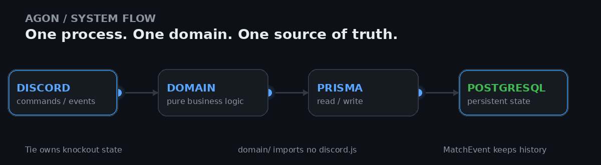
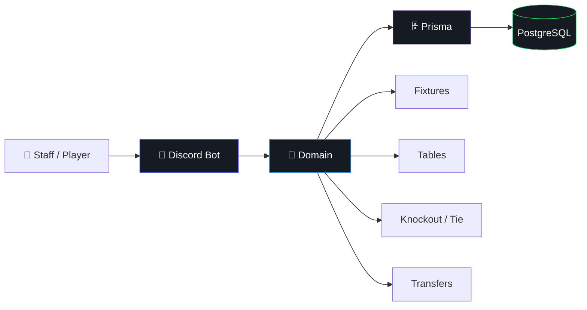
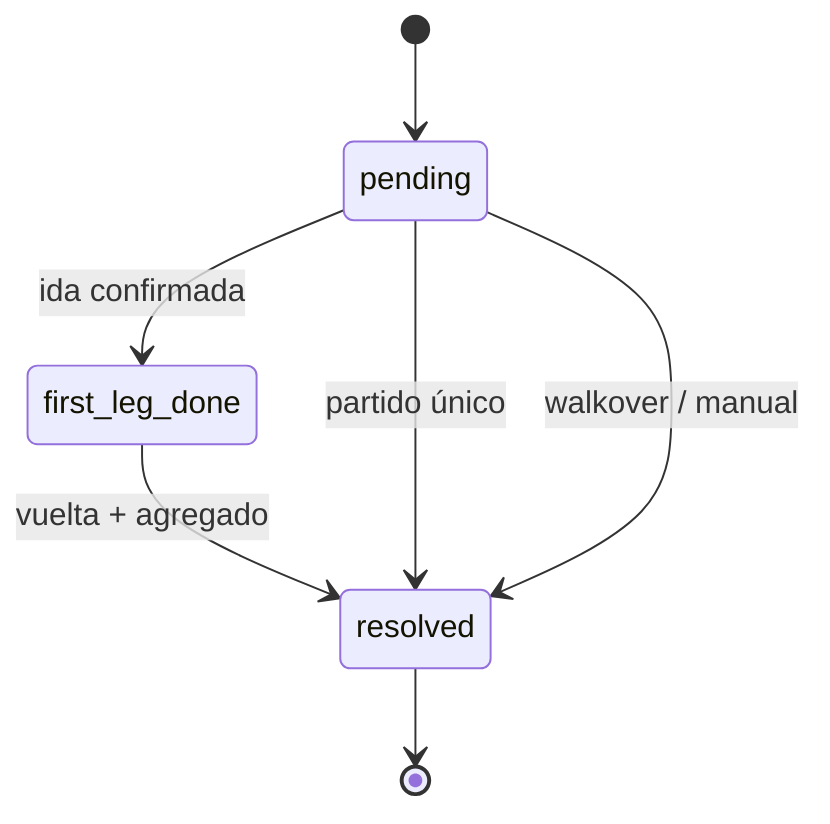
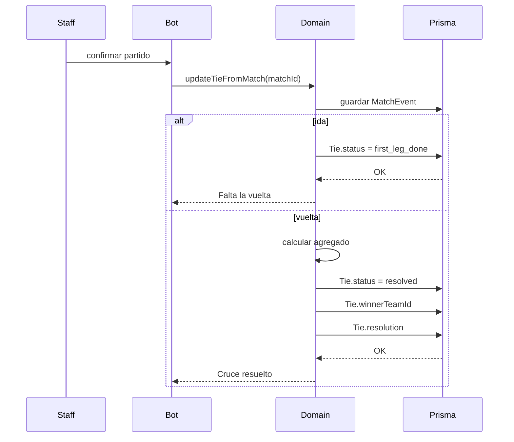
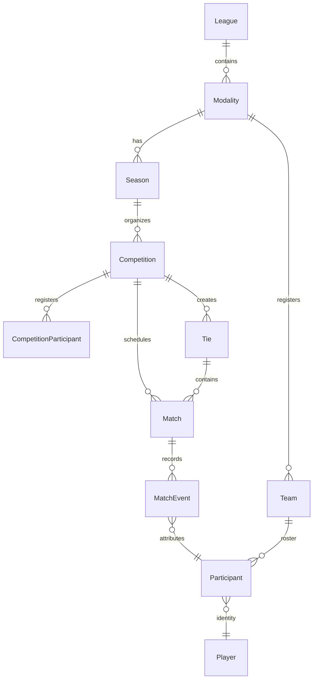

<a id="readme-top"></a>

<p align="center">
  
</p>

<p align="center">
  
</p>

<p align="center">
  
</p>

<p align="center">
  <a href="https://github.com/Kevris/AGON">
    
  </a>
  <a href="https://github.com/Kevris/AGON/blob/main/LICENSE">
    
  </a>
  
</p>

<br>

> **Construido para durar, diseñado para cambiar.**

AGON existe para quitar la fricción de administrar una liga de Haxball de principio a fin:
inscripciones, plantillas, fichajes, competencias, brackets, actas y estadísticas.

La interfaz actual es un bot de Discord. El diseño interno está pensado para que la lógica importante
no dependa de Discord y para que cada pregunta tenga un único lugar donde se resuelva.

<p align="center">
  
</p>

<p align="center">
  <sub>Discord → dominio → persistencia. El estado viaja; la lógica no se duplica.</sub>
</p>

---

## ⚡ En una mirada

<table align="center">
  <tr>
    <td align="center" width="25%">
      <strong>🏛️ Multi-liga</strong><br>
      <sub>La liga se resuelve por <code>interaction.guild.id</code>.</sub>
    </td>
    <td align="center" width="25%">
      <strong>🧠 Dominio puro</strong><br>
      <sub><code>src/domain/</code> no importa <code>discord.js</code>.</sub>
    </td>
    <td align="center" width="25%">
      <strong>⚔️ Tie como estado</strong><br>
      <sub>Un cruce tiene dueño explícito.</sub>
    </td>
    <td align="center" width="25%">
      <strong>📜 Historial</strong><br>
      <sub>Los eventos no se sobrescriben.</sub>
    </td>
  </tr>
</table>

---

<details>
<summary><strong>📖 Navegar por el proyecto</strong></summary>

<br>

- [🏛️ Qué es AGON](#️-qué-es-agon)
- [🎯 Qué resuelve](#-qué-resuelve)
- [🔄 Cómo funciona](#-cómo-funciona)
- [⚔️ La historia de Tie](#️-la-historia-de-tie)
- [📐 Arquitectura](#-arquitectura)
- [🗄️ Modelo de datos](#️-modelo-de-datos)
- [⚙️ Stack técnico](#️-stack-técnico)
- [🧠 Principios de diseño](#-principios-de-diseño)
- [📊 Estado actual](#-estado-actual)
- [🗺️ Roadmap](#️-roadmap)
- [🚀 Desarrollo local](#-desarrollo-local)
- [📄 Licencia](#-licencia)

</details>

---

## 🏛️ Qué es AGON

AGON es un sistema para administrar ligas de Haxball. Cubre el ciclo completo:
inscripción de jugadores, formación de plantillas, ventanas de fichajes con ofertas y vencimientos,
competencias en formato liga o copa, cruces de eliminatoria a ida y vuelta, carga de actas partido a partido
y estadísticas históricas.

Está construido **multi-liga desde el modelo**. Hoy existe una sola liga, pero agregar otra significa
insertar una fila y conectar el bot a otro servidor de Discord, no rediseñar el sistema.

La identidad del jugador vive en Discord. La competición se modela con conceptos propios del sistema,
tomando del fútbol real solo lo que ayuda a representar correctamente sus reglas.

> [!NOTE]
> El bot resuelve la liga a partir de `interaction.guild.id` contra `League.discordGuildId`.
> No existe un ID de liga fijado en la configuración.

---

## 🎯 Qué resuelve

El objetivo no es "hacer un bot con comandos".

El objetivo es convertir toda la operación de una liga en **un solo flujo coherente**:

```text
INSCRIPCIÓN
    ↓
PLANTILLA
    ↓
MERCADO
    ↓
COMPETENCIA
    ↓
FIXTURES
    ↓
PARTIDOS
    ↓
ACTAS
    ↓
ESTADÍSTICAS
    ↓
HISTORIAL
```

Cada etapa escribe datos que la siguiente puede consumir.

El resultado buscado es que la liga no dependa de información duplicada repartida entre mensajes,
comandos y cálculos independientes.

---

## 🔄 Cómo funciona

El bot de Discord es el cliente actual.



La idea importante es simple:

> **Discord es una interfaz. El dominio es el cerebro.**

El bot llama al módulo `src/domain/` directamente, dentro del mismo proceso.
No hay una API HTTP intermedia mientras el único cliente real siga siendo Discord.

### ¿Por qué importa?

Porque la misma lógica puede utilizarse después desde otro cliente.

```text
                ┌───────────────┐
                │   Web futura  │
                └───────┬───────┘
                        │
┌───────────────┐       │       ┌───────────────┐
│ Discord       │───────┼──────▶│   DOMAIN      │
└───────────────┘       │       │               │
                        │       │ fixtures      │
                        │       │ standings     │
                        │       │ transfers     │
                        │       │ brackets      │
                        │       └───────┬───────┘
                        │               │
                        └───────────────┤
                                        ▼
                                  PostgreSQL
```

El día que exista una web, no debería ser necesario reconstruir las reglas desde cero.

> [!TIP]
> `src/domain/` no importa `discord.js`. Esto permite probar la lógica sin levantar el bot
> y deja abierta la posibilidad de compartirla entre diferentes clientes.

---

## ⚔️ La historia de Tie

Una de las decisiones de diseño más importantes de AGON nació de un problema real.

En la versión anterior, un cruce de eliminatoria **no existía como entidad**.
Se reconstruía a partir de partidos sueltos, en varios lugares del bot.

Eso produjo tres síntomas:

```text
BRACKET VACÍO
    ↓
la generación no encontraba un cruce concreto

VUELTA ANTES QUE IDA
    ↓
"¿terminó la ida?" se recalculaba cada vez

RONDA EQUIVOCADA
    ↓
otra parte volvía a interpretar los mismos partidos
```

Tres síntomas.

**Una misma causa: nadie era dueño del estado del cruce.**

AGON lo convierte en una entidad real:

```text
Tie
│
├── id
├── competitionId
├── round
├── teamAId
├── teamBId
│
├── status
│   ├── pending
│   ├── first_leg_done
│   └── resolved
│
├── winnerTeamId
└── resolution
    ├── normal
    ├── walkover
    └── manual
```

Ahora una sola entidad responde:

> **¿Qué toca ahora en este cruce?**

El bracket, el próximo partido y el avance de ronda consultan ese estado.

No lo vuelven a inventar.

### El ciclo



Y cuando la ida o la vuelta se confirman:



> [!IMPORTANT]
> `Match` representa el partido. `Tie` representa el enfrentamiento.
> Uno registra lo que pasó; el otro posee el estado de quién avanza.

---

## 📐 Arquitectura

```text
agon/
│
├── src/
│   ├── bot/
│   │   ├── commands/
│   │   ├── events/
│   │   └── interactions/
│   │
│   │   └── Lo único que sabe que existe Discord.
│   │
│   ├── domain/
│   │   ├── fixtures
│   │   ├── standings
│   │   ├── knockouts
│   │   └── transfers
│   │
│   │   └── Cero imports de discord.js.
│   │
│   └── db/
│       └── Prisma + queries reutilizables
│
├── prisma/
│   └── schema.prisma
│
├── tests/
│   └── Vitest sobre src/domain
│
└── package.json
```

La regla arquitectónica puede resumirse así:

```text
     PRESENTACIÓN
          │
          ▼
       DISCORD
          │
          ▼
        DOMAIN
          │
          ▼
        PRISMA
          │
          ▼
      POSTGRESQL
```

**Una dirección clara. Pocas capas. Ninguna por moda.**

---

## 🗄️ Modelo de datos

AGON parte de una jerarquía explícita:



### Las entidades que sostienen el sistema

| Modelo | Responsabilidad |
|---|---|
| `League` | Techo del sistema. `slug` + `discordGuildId`. |
| `Modality` | Variante del juego y sus reglas. |
| `Season` | Temporada activa de una modalidad. |
| `Team` | Club persistente entre temporadas. |
| `Player` | Identidad. `discordId` único. |
| `Participant` | Ficha de un jugador en una temporada/modalidad. |
| `Competition` | Liga o copa, incluyendo `tier`. |
| `CompetitionParticipant` | Equipos inscritos, grupo y seed. |
| `Tie` | Dueño del estado de un cruce. |
| `Match` | Partido individual. |
| `MatchEvent` | Acta inmutable del partido. |
| `PlayerStatProjection` | Totales agregados a partir de eventos. |
| `ManualStatAdjustment` | Correcciones explícitas y auditables. |
| `Award` | Premio. |
| `AwardWinner` | Ganador de un premio. |
| `CompetitionChampionRoster` | Snapshot del plantel campeón. |
| `TransferOffer` | Oferta de fichaje y su estado. |
| `TransferOfferStatus` | `pending / accepted / rejected / cancelled / expired`. |
| `AuditLog` | Registro de mutaciones: actor, acción y antes/después. |
| `Position` | `GK / DEF / MID / DFWD / FWD / N/A`. |

<details>
<summary><strong>🔍 ¿Por qué separar Player y Participant?</strong></summary>

<br>

`Player` representa la identidad.

`Participant` representa a esa misma identidad dentro de una modalidad y temporada concreta.

```text
Player
  │
  ├── Season A → Participant → Team X
  │
  └── Season B → Participant → Team Y
```

Así, la historia competitiva no depende de sobrescribir la identidad original.

</details>

<details>
<summary><strong>📜 ¿Por qué MatchEvent es inmutable?</strong></summary>

<br>

El acta no se corrige destruyendo historia.

Cuando un evento debe revertirse, se registra:

```text
event_reverted → targetEventId
```

De esa forma, la verdad histórica del partido permanece reconstruible.

</details>

<details>
<summary><strong>⚙️ ¿Por qué Competition.settings es JSON?</strong></summary>

<br>

Las reglas de una competición pueden cambiar entre ligas o torneos:

```text
wildcards
wait time
walkover threshold
points
tie-break rules
```

La intención es que esas reglas sean datos de la competición y no constantes enterradas en TypeScript.

</details>

---

## ⚙️ Stack técnico

<p align="center">
  
</p>

| Capa | Tecnología | Decisión |
|---|---|---|
| Runtime | Node.js | Un solo runtime para el sistema. |
| Lenguaje | TypeScript | Tipado compartido entre dominio, bot y DB. |
| Bot | discord.js | Cliente actual de AGON. |
| ORM | Prisma | Schema y migraciones versionadas. |
| Base de datos | PostgreSQL | Persistencia principal. |
| Tests | Vitest | Tests del dominio sin levantar Discord. |
| Hosting | VPS pequeño / host de bots | Un solo proceso Node. |

> [!NOTE]
> No hay Docker, API separada ni servicio de autenticación multi-cliente en esta etapa.
> La arquitectura deja espacio para crecer sin pagar complejidad antes de tener un segundo cliente real.

---

## 🧠 Principios de diseño

### 01 · El dominio no conoce la interfaz

`discord.js` es una integración.

No es la arquitectura entera.

### 02 · Una pregunta, un dueño

Si el sistema necesita saber:

> "¿Qué pasa ahora?"

debe existir un único lugar responsable de responderlo.

`Tie` es el ejemplo más claro.

### 03 · Reglas como datos

Cuando una regla pertenece a una competición, se intenta modelarla como configuración
en lugar de convertirla en un `if` global.

### 04 · La historia no se sobrescribe

Los eventos importantes deben poder reconstruirse.

Por eso los eventos del partido son inmutables y las correcciones quedan registradas.

### 05 · Multi-liga desde el modelo

`League` está arriba de la jerarquía desde el principio.

Agregar otra liga no debería exigir duplicar lógica.

### 06 · Diseñar para cambiar

AGON no intenta adivinar el sistema perfecto antes de usarlo.

Las costuras importantes se dejan preparadas.

El resto se aprende construyendo.

---

## 📊 Estado actual

| Componente | Estado | Situación |
|---|:---:|---|
| Schema v1 | ✅ | Completo y validado. |
| Dominio puro | ✅ | Fixtures, tablas y avance de cruces definidos. |
| Entidad `Tie` | ✅ | Estado explícito del cruce. |
| Eventos inmutables | ✅ | Correcciones mediante `event_reverted`. |
| Mercado | ✅ | Máquina de estados de transferencias. |
| Bot de Discord | 🟡 | En desarrollo. |
| Web pública | ⏸️ | Pospuesta hasta tener datos reales que mostrar. |

> [!NOTE]
> El proyecto está en fase de diseño y primeros borradores.
> El siguiente corte es convertir el modelo en el primer conjunto de comandos operativos.

---

## 🗺️ Roadmap

```text
FOUNDATION
├── [x] Modelo de dominio completo
├── [x] Entidad Tie
├── [x] Eventos de partido inmutables
└── [x] Mercado con máquina de estados

BOT
├── [ ] /setup
├── [ ] /league-team
├── [ ] /league-competition
├── [ ] Generación de fixtures
├── [ ] Carga de actas
└── [ ] Cálculo de tablas

COMPETITION
├── [ ] Avance de rondas
├── [ ] Premios
└── [ ] Palmarés

FUTURE
└── [ ] Web pública
```

---

## 🚀 Desarrollo local

> Esta sección sigue deliberadamente mínima: el README actual documenta la arquitectura y el modelo;
> los comandos exactos de instalación/ejecución dependerán del `package.json` y del estado de implementación.

```bash
git clone https://github.com/Kevris/AGON.git
cd AGON
npm install
```

Después, configura las variables de entorno y la conexión de Prisma/PostgreSQL según el entorno local.

---

## 🧩 Decisiones interesantes

<details>
<summary><strong>¿Por qué un solo proceso?</strong></summary>

<br>

Porque hoy existe un solo cliente real: Discord.

Separar procesos ahora añade contratos, despliegues y complejidad sin un consumidor que lo necesite.

</details>

<details>
<summary><strong>¿Por qué no una API HTTP?</strong></summary>

<br>

Por la misma razón.

El bot puede llamar al dominio directamente. Una API gana sentido cuando exista un segundo cliente
que realmente la necesite.

</details>

<details>
<summary><strong>¿Por qué no empezar por autenticación?</strong></summary>

<br>

Porque la versión anterior comenzó por infraestructura para clientes que todavía no existían.

AGON invierte el orden:

```text
modelo
  ↓
dominio
  ↓
cliente real
  ↓
infraestructura adicional cuando haga falta
```

</details>

---

## 📄 Licencia

MIT.

<p align="center">
  <sub>Build it. Break it. Understand it. Make it better.</sub>
</p>

<p align="center">
  
</p>

<p align="center">
  <a href="#readme-top">↑ volver arriba</a>
</p>

<p align="center">
  
</p>
