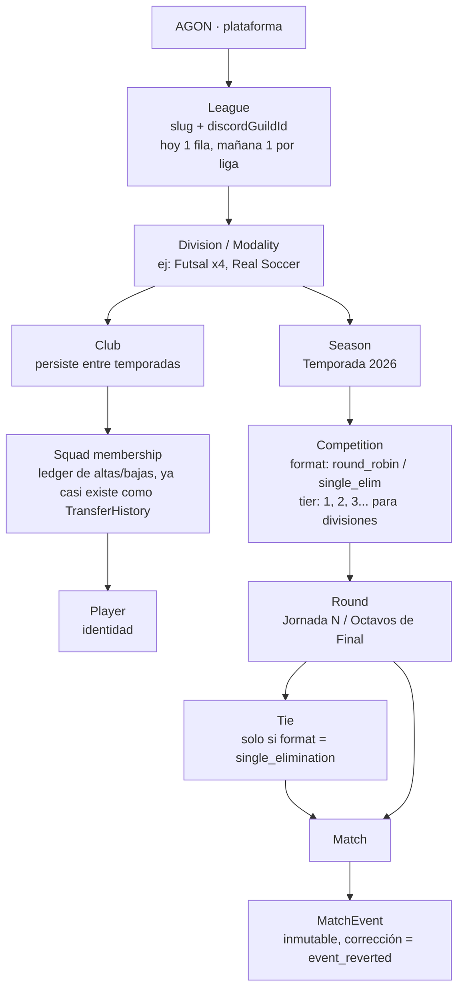

# AGON — Modelo de dominio y arquitectura (v0.9)

> v0.4 fue el veredicto sobre el schema real de la V4 abandonada. Esta versión (v0.5) confirma que **multi-liga sí es un objetivo real** (`agon/haxven`, `agon/haxcol`), solo que no urgente, y ya tiene un primer borrador de código: **`agon-schema-v1-draft.prisma`**, entregado junto a este documento.

> v0.1 fusionaba mi análisis de V3 con un análisis técnico externo. v0.2 lo confirmaba contra el código real de V3 completo. **Esta versión (v0.3) es un recorte de alcance, no solo un ajuste** — leí los documentos de la V4 que abandonaste (`00-indice`, `01-arquitectura-resumen`, `02-modelos`, `03-seguridad`) más dos docs viejos de V3 (`f5.md`, `holasi.md`), y con "la app de árbitros afuera, la web opcional para después" el diseño correcto ya no es el mismo que el de esos documentos. Ver §0.

## 0. Por qué esto pesaba tanto — y qué cambia al cortar alcance

Los cuatro documentos de V4 que me pasaste están **bien pensados a nivel de modelo** — de hecho varias ideas ahí son mejores que las que yo había propuesto en v0.1/v0.2 (lo detallo en §5-cuater). El problema nunca fue la calidad de las ideas. Fue que ese diseño resuelve un problema de **tres clientes con necesidades de seguridad distintas** (bot, app de árbitros, web) — y eso es lo que obliga a todo lo pesado:

- PostgREST como servicio aparte → necesita su propio proceso corriendo, su propio rol de Postgres, sus propias vistas SQL versionadas.
- JWT + `PGRST_JWT_SECRET` + `BOT_SERVICE_SECRET` → necesario porque la app de árbitros necesita autenticarse sin ser el bot, y el bot necesita "vouchear" por usuarios de Discord sin pasar por OAuth.
- `UserRole` con scope → necesario porque hay un cliente (la app) donde no podés simplemente mirar "¿tiene este rol de Discord?" en vivo.

**Sacá la app de árbitros y dejá la web para después, y con un solo cliente real (el bot) nada de eso hace falta hoy.** El bot ya puede resolver permisos mirando roles de Discord en vivo — como hace V3 ahora mismo — sin ninguna capa de JWT en el medio. Eso no es "hacerlo peor por ahora": es no construir infraestructura para un cliente que no existe. El día que la web sea real y tenga sesiones propias sin el bot de por medio, ahí sí esa infraestructura se gana su lugar — no antes.

Esto es lo que de verdad estabas sintiendo como "mucho para vos en ese momento": no era el modelo de datos, era tener que levantar y operar 3 servicios (bot, API de escritura, PostgREST) más un esquema de auth de tres capas, para un proyecto que hoy tiene un solo cliente.

## 0-bis. Lo que se corta, lo que se pospone, lo que se queda

|                                                                                                                     | Decisión                                                                        | Motivo                                                                                                                                                                                                                                                                                      |
| ------------------------------------------------------------------------------------------------------------------- | ------------------------------------------------------------------------------- | ------------------------------------------------------------------------------------------------------------------------------------------------------------------------------------------------------------------------------------------------------------------------------------------- |
| App de árbitros                                                                                                     | **Se corta del todo**                                                           | Confirmado por vos — no aporta hoy                                                                                                                                                                                                                                                          |
| Web pública                                                                                                         | **Se pospone, sin diseñar en contra de ella**                                   | El schema (Postgres + dominio puro sin `discord.js`) ya la deja fácil de sumar el día que la quieras — no hace falta construir nada de ella ahora                                                                                                                                           |
| PostgREST como servicio separado                                                                                    | **Se pospone**                                                                  | Sin un segundo cliente real, es un servicio más para desplegar y operar sin nadie que lo consuma todavía                                                                                                                                                                                    |
| JWT / `BOT_SERVICE_SECRET` / `UserRole` con scope                                                                   | **Se pospone**                                                                  | Resuelve un problema de multi-cliente que no existe con un solo cliente (el bot)                                                                                                                                                                                                            |
| `TeamBranding` / `TeamDiscordMeta` / `ModalityDiscordConfig` separados                                              | **Se simplifica**: quedan como campos directos en `Team`/`Modality`, como en V3 | Separarlos hoy es preparar una migración para un cliente no-Discord que todavía no existe — cuando exista, separar esos campos es un `ALTER TABLE` de una tarde, no algo que haya que adivinar bien a la primera                                                                            |
| Postgres desde el día 1                                                                                             | **Se mantiene**                                                                 | No es una complejidad nueva — es la misma base de datos, mejor motor. Gratis en Supabase/Neon para este tamaño de proyecto                                                                                                                                                                  |
| Dominio puro separado del bot (`packages/domain` o carpeta `src/domain/`)                                           | **Se mantiene, sin el monorepo alrededor**                                      | El valor (lógica testeable, reusable el día de la web) no depende de que sea un paquete npm separado — alcanza con que sea una carpeta que no importa `discord.js`                                                                                                                          |
| `MatchEvent` inmutable + `event_reverted`, `ManualStatAdjustment`, `TransferOffer`, `AuditLog`, `Tie` para brackets | **Se mantienen tal cual**                                                       | Son decisiones de *modelo*, no de infraestructura — cuestan lo mismo construir en un monolito que en microservicios, y son las que de verdad evitan bugs                                                                                                                                    |
| `Stage` como tabla separada entre `Competition` y `Round` (mi propuesta de v0.1)                                    | **Se pospone**                                                                  | Ninguna competencia tuya hoy combina grupos + eliminatoria en un solo torneo — alcanza con `Competition.format` (`round_robin` \| `single_elimination` \| `groups`). El día que quieras un torneo híbrido de verdad, `Stage` se agrega arriba sin romper nada — no hace falta pagarlo ahora |

En criollo: **el modelo de datos de V4 me parece casi todo correcto — el error fue el tamaño del despliegue alrededor, no el tamaño del schema.** Bajamos el segundo, conservamos casi todo el primero.

---

## 0-cuater. Veredicto — qué me quedo del `schema.prisma` real, qué corto, qué agrego

Leí el schema completo (655 líneas) y la bitácora de 5 sesiones de trabajo. Esto confirma y agrava el diagnóstico de §0: para cuando se abandonó, ya existían JWT real (`@fastify/jwt`), OAuth2 de Discord, el flujo `BOT_SERVICE_SECRET` de "el bot vouchea por el usuario", una tabla `UserRole` con scope, 10 archivos de rutas en `apps/api`, el motor completo del bot (loaders, dispatch de botones)... y **todavía no se había escrito un solo comando de bot ni una sola pantalla.** Además, la nota honesta de la última entrada de la bitácora es clave: `apps/api` nunca corrió `prisma generate` contra una red real, así que compiló limpio solo porque Prisma cayó a un stub `any` — es decir, esa mitad del sistema **nunca se validó de verdad**. Esto no es una crítica al trabajo — es exactamente la evidencia de que el orden estaba invertido: infraestructura de autenticación multi-cliente antes que una sola feature visible.

Con "app de árbitros afuera, web opcional después" ya confirmado por vos, esto es lo que decido, modelo por modelo:

| Del schema real                                                                                                                                                                            | Decisión                                                                                                               | Por qué                                                                                                                                                                                                                                                                                                                                                                                    |
| ------------------------------------------------------------------------------------------------------------------------------------------------------------------------------------------ | ---------------------------------------------------------------------------------------------------------------------- | ------------------------------------------------------------------------------------------------------------------------------------------------------------------------------------------------------------------------------------------------------------------------------------------------------------------------------------------------------------------------------------------ |
| `User`, `UserRole`, `AppRole`, `RoleScope`                                                                                                                                                 | **Se cortan enteros**                                                                                                  | Resuelven "¿qué puede hacer este usuario en qué alcance?" para un mundo con 3 clientes. Con un solo cliente (el bot), la respuesta sigue siendo "¿tiene tal rol de Discord ahora mismo?" — cero tablas nuevas, como ya hace V3                                                                                                                                                             |
| JWT, OAuth2 de Discord, `BOT_SERVICE_SECRET`, `/auth/bot-token`                                                                                                                            | **Se cortan enteros**                                                                                                  | Sin un segundo cliente autenticándose por su cuenta, no hay nada que este flujo resuelva que Discord no resuelva ya gratis dentro del propio proceso del bot                                                                                                                                                                                                                               |
| `apps/api` (Fastify) como servicio separado, las 10 rutas ya escritas                                                                                                                      | **Se posponen como servicio** — pero el criterio "¿consulta o acción con reglas?" de cada ruta se conserva como diseño | El día que haya web, esas 10 rutas son un excelente punto de partida (ya pensadas, ya con Zod) — hoy se vuelven funciones que el bot llama directo, sin HTTP en el medio                                                                                                                                                                                                                   |
| `packages/domain/fixtureGenerator.ts` (round robin + eliminatoria) y `matchScore.ts`, con sus 17 tests                                                                                     | **Se quedan tal cual, es el activo más valioso de todo lo que se construyó**                                           | Es exactamente la lógica pura que faltaba en V3 y causó los bugs de esta sesión — y ya está escrita y validada de verdad (`tsc` real + tests, a diferencia de `apps/api`)                                                                                                                                                                                                                  |
| `TeamBranding`, `TeamDiscordMeta`, `ModalityDiscordConfig`, `MatchClientMeta`, `TransferOfferClientMeta` (5 tablas 1:1 separadas)                                                          | **Se colapsan de vuelta en `Team`/`Modality`/`Match`/`TransferOffer`**                                                 | Separarlas cuesta un join extra en cada lectura, hoy, para un cliente no-Discord que no existe. Volver a separarlas el día que haga falta es un `ALTER TABLE` de una tarde — no hay nada que se pierda por esperar                                                                                                                                                                         |
| `CompetitionType` (`league/cup/friendly/other`) **y además** `CompetitionFormat` (`liga/copa/liga_playoffs`)                                                                               | **Se colapsan en un solo campo**                                                                                       | Son dos enums para decir casi lo mismo — quedó así de una sesión a otra sin que nadie lo unificara. Un único `format: round_robin \| single_elimination` alcanza; "amistoso" es una liga de un partido, no necesita su propio valor                                                                                                                                                        |
| `Competition.tier` para multi-división                                                                                                                                                     | **Se mantiene igual**                                                                                                  | Ya está bien resuelto, coincide con lo que yo mismo había propuesto sin haber visto este schema                                                                                                                                                                                                                                                                                            |
| `MatchEvent` inmutable + `event_reverted`, `ManualStatAdjustment`, `PlayerStatProjection`, `Award`/`AwardWinner`, `CompetitionChampionRoster`, `Team.dtParticipantId`/`subDtParticipantId` | **Se mantienen tal cual, sin cambios**                                                                                 | Esto ya lo había validado en v0.3 contra los documentos, y el schema real lo confirma bien escrito                                                                                                                                                                                                                                                                                         |
| **Ninguna tabla `Tie` / cruce de eliminatoria**                                                                                                                                            | **Se agrega — sigue faltando**                                                                                         | Revisé el schema completo: `Match` tiene `leg`/`roundType` igual que V3, y `generateKnockoutNextRound` en el dominio genera rondas nuevas trabajando directo sobre `Match` sueltos. O sea que **ni el V3 real ni esta V4 avanzada resolvieron el problema de fondo que causó los bugs de esta sesión.** Confirma que `Tie` no es una preferencia mía — es la pieza que faltó las dos veces |

**Resultado neto:** de 26 modelos en el schema real, quedan ~20, todos ya escritos por vos, más `Tie` que se agrega. Cero JWT, cero segundo servicio, cero tabla de roles. El bot le pega directo a Prisma en el mismo proceso. Lo que hoy es `apps/api` queda como documentación de referencia para cuando exista la web — no como algo que haya que correr ahora.

## 0-quinquies. Confirmado: multi-liga es un objetivo real, no una hipótesis

Dijiste algo clave: el día de mañana, un bot gratis para cualquier liga de Haxball, cada una con su espacio en la plataforma (`agon/haxven`, `agon/haxcol`). Eso es **multi-tenant real**, no "por si acaso" — solo que no es para ahora ("por ahora solo la usaré en mi liga hasta que llegue a una versión muy buena"). Dos cosas cambian con esto:

1. **`League` deja de ser opcional en el schema.** Ya estaba en mis borradores como techo de la jerarquía, pero ahora tiene motivo concreto para llevar `slug` (para la URL futura) y `discordGuildId` desde ya — hoy va a haber una sola fila con esos dos campos llenos, pero el bot resuelve la liga por `interaction.guild.id`, nunca por config fija. Sumar una segunda liga el día de mañana es insertar una fila e invitar el bot a ese servidor — no una migración que toque cada tabla. Ya está en `agon-schema-v1-draft.prisma`.
2. **Corrijo un error mío de v0.1**: había puesto `League → Season → Modality` en el diagrama. El schema real (y la lógica, viéndolo bien) es `League → Modality → Season` — una modalidad (Futsal x4) tiene sus propias temporadas, no al revés. Ya corregido en el schema adjunto.

## 0-sex. La lección de iDinox — diseñar para poder cambiar, no para adivinar todo hoy

Dijiste algo que vale la pena dejar escrito como principio, no solo como anécdota: iDinox se diseñó hace tiempo, y al ponerlo en una liga real, "muchas cosas se salieron de los planes" y hubo que ir agregando y cambiando sobre la marcha. Eso no es una falla de planificación — es lo esperable. Ningún diseño hecho antes de que usuarios reales lo usen predice todo lo que va a hacer falta. El propio `Tie` que agregamos esta sesión es el ejemplo perfecto: nadie lo vio venir hasta que una copa real lo necesitó y falló de tres formas distintas.

La consecuencia práctica para AGON no es "planeemos mejor para no repetir esto" — es diseñar asumiendo que **vamos a seguir descubriendo cosas**, y que lo barato de cambiar importa más que lo completo del plan inicial. Es el mismo criterio detrás de cada corte de este documento:

- `Stage` (fase de grupos + eliminatoria combinadas) no se construye ahora — se agrega arriba del schema el día que una competencia real lo necesite, sin romper nada de lo anterior.
- El auth multi-cliente no se construye ahora — el día que la web sea real, agregar Discord OAuth (con `League` y `discordId` ya en el schema) es incremental, no una reescritura.
- Las 5 tablas `*Meta`/`*Branding` colapsadas no se pierden como idea — separar campos de una tabla a otra el día que haga falta es una migración de una tarde, no un rediseño.

Esto también es una señal para mí: no voy a tratar de anticipar cada regla que una liga real de Haxball pueda llegar a necesitar. Vamos a construir lo que sabemos que hace falta hoy, dejar las costuras baratas donde ya sabemos que algo puede crecer (Tie, League, `Competition.settings` como JSON para reglas específicas), y confiar en que el resto se va a ver con uso real — como pasó con iDinox, y como ya pasó esta sesión con la copa.

## 1. De qué parte esto

Dos insumos:

1. **Lo que vi auditando V3 en esta sesión** (bugs de copa, `settings` como JSON universal, avance de ronda repetido en tres lugares, cero tests).
2. **El análisis técnico que pegaste**, que acierta en varias cosas concretas: `League` como entidad raíz, separar la liga del servidor de Discord, no meter ajustes manuales de stats dentro del total, y eventos con autor/motivo rastreable.

Estoy de acuerdo con el fondo de ese análisis. Lo que agrego es la mitad que falta: **cómo se arma un torneo por dentro** (ligas, copas, grupos, brackets) — porque ese fue el 90% de lo que reventó hoy en V3, y el documento que me pasaste no entra en ese nivel.

---

## 2. La idea central: tomar el fútbol real, pero donde de verdad ayuda

El fútbol real ya resolvió problemas que a nosotros nos están costando caro: cómo separar "el club" de "quién juega este año", cómo tener liga y copa corriendo en paralelo sin duplicar modelos, cómo manejar un cruce a ida y vuelta como una sola unidad en vez de dos partidos sueltos.

Pero hay partes del fútbol real que **no aplican** y que si las copiamos ciegamente nos complican la vida gratis: no hay estadios, no hay árbitros de FIFA, no hay TV, no hay fechas FIFA. Lo virtual tiene reglas propias: los capitanes acuerdan horario entre ellos, alguien tiene que anotar los goles a mano viendo la partida, existen wildcards y walkovers, y la identidad del jugador vive en Discord, no en un DNI.

Tabla de qué se toma y qué se adapta:

| Concepto del fútbol real                        | Lo tomamos como                                     | Adaptación para liga virtual                                                                                                                                |
| ----------------------------------------------- | --------------------------------------------------- | ----------------------------------------------------------------------------------------------------------------------------------------------------------- |
| Club (entidad persistente)                      | `Club`                                              | Persiste entre temporadas; en V3 hoy esto ya casi existe como `Team`, pero mezclado con la inscripción de la temporada                                      |
| Plantilla / ficha de jugador por temporada      | `Squad` + `SquadMembership`                         | En vez de "el jugador pertenece a un equipo" (un campo que pisa el anterior), es un historial de periodos — igual que una ficha FIFA con fecha de alta/baja |
| Competición (Liga, Copa del Rey, Champions)     | `Competition`                                       | Una liga virtual puede tener liga regular + copa corriendo en la misma temporada, cada una con sus reglas propias                                           |
| Fase de grupos + eliminatoria (ej. Champions)   | `Stage` dentro de una `Competition`                 | Esto es lo que hoy V3 no puede modelar: una competencia con una fase de grupos y después bracket. Con `Stage` sí se puede                                   |
| Jornada / eliminatoria (octavos, cuartos...)    | `Round`                                             | Nombre y orden dependen del `Stage`, no hardcodeado en código                                                                                               |
| Cruce a ida y vuelta (ej. octavos de Champions) | `Tie`                                               | **Esta es la pieza que hoy no existe en V3** y es la raíz de casi todos los bugs de esta sesión (ver §5.4)                                                  |
| Partido                                         | `Match`                                             | Igual que hoy, pero ya no es dueño de "quién ganó el cruce" — eso lo decide el `Tie`                                                                        |
| Acta del partido (goles, tarjetas, minuto)      | `MatchEvent`                                        | Igual espíritu que V3 (`MatchEvent`), con autor y corrección rastreable — acá el análisis que pegaste ya tenía razón                                        |
| Federación / asociación organizadora            | `League`                                            | Punto en el que más coincide con el análisis que pegaste: es el "tenant", el dueño de todos los datos de una liga particular                                |
| Estadio / sede                                  | *(no existe)*                                       | Reemplazado por dónde se anuncia y juega: un hilo de Discord, un código de sala — es una integración, no una entidad del dominio                            |
| Árbitro de partido                              | `MatchOfficial` (rol, no persona física con carnet) | Quien carga el acta — puede ser un capitán, un staff, o el propio sistema si hay integración con stats automáticas                                          |

---

## 3. Jerarquía de entidades



Puntos que vale la pena remarcar (revisados a la baja respecto a v0.1/v0.2, ver §0-bis):

- **`League` sigue siendo el techo de todo**, pero por ahora sin una tabla `LeagueIntegration` aparte — la config de Discord (guild id, canales, roles) vive en campos directos de `League`/`Modality`, exactamente como ya hace V3. Se separa el día que haya una segunda integración real que no sea Discord.
- **`Division`/`Modality`** sin cambios respecto a hoy.
- **`Club` vs membresía de plantel** — la separación entre "quién es el equipo" y "quién juega esta temporada" ya casi existe en V3 como `TransferHistory` (ver §5-bis); no hace falta una tabla `Squad` nueva, hace falta dejar de tratar `Participant.teamId` como si fuera el historial y tratarlo como lo que es: un puntero al último estado del ledger.
- **`Competition.format` reemplaza a `Competition.type`** ("league"/"cup" pasa a ser un valor de formato entre otros: `round_robin`, `single_elimination`, y `groups` si algún día hace falta). `tier` (ya existe en V3 como `division: number`) resuelve Primera/Segunda división sin modelo nuevo, tal como ya lo tenían pensado en los docs de V4.
- **`Tie` es la única pieza estructural genuinamente nueva de todo este documento**, y ninguno de los dos diseños anteriores (ni V3, ni la V4 abandonada) la tiene — ver `02-modelos.md`: ahí "multi-división" está resuelto, pero el cruce ida/vuelta de una copa no se menciona en ningún lado. Sigue siendo la pieza que de verdad hace falta agregar.

---

## 4. Por qué `Tie` (cruce) resuelve la mitad de los bugs de hoy

Repasemos qué pasó en esta sesión, todo por la misma causa: **el cruce ida/vuelta no existe como entidad, se reconstruye al vuelo cada vez que alguien lo necesita.**

- El bracket se veía vacío recién generado → porque la función que arma el bracket leía `Match`, no `Fixture`, y "cruce" no era nada concreto que buscar.
- La vuelta se creaba antes que la ida → porque "¿ya terminó la ida?" era una pregunta que había que responder calculando sobre partidos sueltos cada vez, y se calculó mal la primera vez.
- El botón de plantilla mostraba la ronda equivocada → la misma pregunta ("¿qué ronda toca anunciar ahora?"), calculada por tercera vez, con un criterio ligeramente distinto a las otras dos.

Si `Tie` fuera una fila real en la base:

```
Tie
├── id
├── round_id
├── team_a_id, team_b_id
├── legs_played   → 0, 1, o 2
├── status        → pending | first_leg_done | resolved
├── winner_team_id
└── resolution    → normal | walkover | manual (empate en agregado)
```

...entonces "¿qué toca ahora?" deja de ser una función que hay que escribir tres veces con matices distintos, y pasa a ser: `SELECT * FROM ties WHERE status != 'resolved' ORDER BY round LIMIT 1`. El estado vive en un solo lugar. Un `Match` se crea, se juega, se confirma → el evento de confirmación actualiza el `Tie` una sola vez, en un solo pipeline. Todo lo demás (bracket visual, plantilla de anuncio, próximo paso) *lee* ese estado, no lo recalcula.

---

## 5. Lo que tomo tal cual del análisis que pegaste

Sin vueltas, porque están bien:

- **`League` como entidad raíz** y **`LeagueIntegration`** separando la liga de "vive en tal servidor de Discord". Un server puede cambiar, cerrarse, o la liga puede sumar un segundo server — la identidad de la liga no depende de eso.
- **Historial de plantilla real** (altas/bajas con fecha) en vez de un campo que se pisa. Coincide exactamente con `Squad`/`SquadMembership` de arriba.
- **Reglas de competición explícitas** (puntos por victoria/empate/derrota, criterios de desempate, reglas de walkover) como configuración de la `Competition`, no como excepciones metidas en el código. Hoy varias de estas reglas —wildcards, tiempo de espera, diferencia de goles— están *hardcodeadas como texto* en la plantilla de anuncio (`scheduleTemplate.ts`). Deberían salir de settings de la competencia.
- **Eventos con autor, motivo y capacidad de corrección**, en vez de solo un marcador final. Esto ya es parcialmente así en V3 (`MatchEvent`, `createdBy`) — hay que llevarlo hasta el final: toda corrección queda registrada, nunca se sobreescribe en silencio.
- **Stats normalizadas donde tenga sentido, no todo en JSON.** Goles, asistencias, partidos jugados, minutos → columnas propias, indexables. Cosas realmente variables por modalidad → ahí sí JSON, pero acotado, no todo el objeto.
- **URL de la liga no atada al servidor de Discord** (`agon.gg/liga/slug` o `slug.agon.gg`), por la misma razón que `LeagueIntegration`.

---

## 5-bis. Confirmado contra el código real de V3 (no solo contra la teoría)

Volví a entrar al zip que me pasaste y miré modelo por modelo, no solo los que tocamos arreglando la copa. Buena noticia: **V3 ya tiene más de esto resuelto de lo que pensaba** — no es que haya que inventar todo, es que hay que *formalizar* patrones que ya existen como código disperso.

| En V3 hoy                                                                                | Cómo está resuelto                                                                                                                                                                                                            | Qué le falta para AGON                                                                                                                                    |
| ---------------------------------------------------------------------------------------- | ----------------------------------------------------------------------------------------------------------------------------------------------------------------------------------------------------------------------------- | --------------------------------------------------------------------------------------------------------------------------------------------------------- |
| `Participant` (jugador inscripto en una temporada+modalidad, con `teamId` actual)        | Bien pensado — separa identidad (`Player`) de inscripción                                                                                                                                                                     | Su historial de equipos no vive en el mismo lugar (ver siguiente fila)                                                                                    |
| `TransferHistory` (from/to team, motivo, quién lo hizo, cuándo)                          | **Ya es, básicamente, el ledger de membresías que yo proponía como `SquadMembership`.** No hay que inventarlo, hay que reconocerlo como la fuente de verdad y dejar de tratar `Participant.teamId` como si fuera el historial | Formalizarlo: el equipo "actual" de un participante debería ser una vista derivada del ledger, no un campo que se pisa y ya                               |
| `Stat.values` / `Stat.matchValues` (JSON)                                                | Los campos ya son finitos y conocidos: `goles, asistencias, vallas, autogoles, mvp, pj, mj`                                                                                                                                   | Exactamente el caso de "normalizá esto" — no es JSON abierto, es un JSON con 7 llaves fijas hace rato. Columnas propias en AGON                           |
| `Award` / `AwardWinner`                                                                  | Ya separa el premio (con `autoType` para los automáticos: goleador, asistencias, vallas) de quién lo ganó                                                                                                                     | Se lleva prácticamente igual a AGON como `Trophy` / `TrophyWinner`                                                                                        |
| `CompetitionChampionRoster`                                                              | Snapshot del plantel campeón al momento de salir campeón                                                                                                                                                                      | Se mantiene igual — es exactamente el tipo de snapshot que sí conviene materializar (a diferencia de standings, que se recalculan)                        |
| `MatchSegment` (1t/2t/ex/ft, con `.hbr2` adjunto)                                        | El sistema de grabaciones ya está modelado por tramo de partido                                                                                                                                                               | Pasa a `MatchRecording` en AGON, sin cambios de fondo                                                                                                     |
| `PlayerNickHistory`                                                                      | Rastrea qué apodos usó cada participante                                                                                                                                                                                      | Señal de un problema real: identificar quién es quién cuando el staff carga stats escribiendo un nombre a mano. Merece seguir existiendo tal cual en AGON |
| `SignOffer` (oferta de fichaje, con `isEmergency`, `expiresAt`, `replacedParticipantId`) | El mercado ya modela ofertas con vencimiento y fichajes de emergencia que reemplazan a alguien del plantel                                                                                                                    | Pasa a `TransferOffer` en AGON, conservando la misma máquina de estados (`pending/accepted/rejected/cancelled/expired`)                                   |

**Conclusión de este repaso:** el problema de V3 nunca fue "falta modelar cosas" en el lado de jugadores/mercado/premios — ahí está bastante bien. El problema estaba concentrado casi enteramente en el lado de **competencias y brackets** (`settings` como JSON universal, cruce sin entidad propia) — que es justo la parte que auditamos en vivo esta sesión. Eso confirma que el rediseño puede ser puntual en esa área y conservador en el resto.

## 5-ter. Superficie funcional completa (de las tres guías que me pasaste)

Las guías muestran bastante más de lo que había cubierto en v0.1 — sobre todo del lado del jugador/DT, no solo del staff. Lo agrupo por dónde cae cada cosa en el modelo de AGON:

**Identidad y carrera del jugador** — `/start`, `/perfil`, `/league-tops`, `/league-history`, `/league-compare`. Todo esto es **lectura agregada** sobre `Player` + `Stat` + `Trophy`, navegable (modalidad → temporada → competencia → partido) y comparativa entre dos jugadores. Es el ejemplo más claro de "esto es candidato a vista de PostgREST", no lógica que deba vivir en el bot: rankings, comparaciones y palmarés son consultas, no comandos con reglas de negocio.

**Gestión de club** — `/club`, `/club-unis`, `/set-subdt`, `/league-team sync-roster`. Acá aparece un patrón específico de liga virtual que vale la pena nombrar aparte: **la reconciliación entre el rol de Discord y el roster en base**. Hoy `sync-roster` es un comando manual que el staff corre cuando algo se desincroniza (alguien se va del server, pierde el rol, vuelve, y el rol no se le devuelve solo). Para AGON, en vez de que esto sea un comando de "arreglar a mano", el bot debería ser la única fuente que asigna/quita el rol de equipo (en cada alta, baja o transferencia el bot toca el rol), y dejar `sync-roster` como una herramienta de auditoría/reparación para cuando el rol se tocó por fuera del bot — no como el mecanismo principal.

**Mercado de fichajes** — `/market-sign`, `/market-release`, `/market-agents`, ventanas de apertura/cierre, fichajes de emergencia con cupo por equipo. Esto es una máquina de estados completa (`TransferOffer`: pending → accepted/rejected/cancelled/expired) con un efecto colateral claro al aceptarse: mover al jugador de plantel y dejar el asiento en el ledger de `TransferHistory`. Encaja directo en el módulo de dominio, sin tocar Discord.

**Partidos y competencia** — `/partidos`, `/tabla`. Confirma algo importante para el diseño de `Stage`: **el mismo comando (`/tabla`) tiene que poder mostrar tabla de posiciones, tabla por grupos, o cuadro de eliminatoria, según el `Stage` de la competencia que se esté mirando.** Es la prueba de que el modelo por `Stage` (§3) no es capricho mío — la propia guía ya asume que una competencia puede "tener fase de grupos" y "tener eliminatorias" como dos cosas separadas que pueden convivir.

**Reglas específicas de liga virtual** que hoy están como texto fijo en el código (wildcards, tiempo de espera de 15 minutos, diferencia de 7 goles, W.O. que resta 1 punto, gol fantasma para situaciones de jugadores de menos) — esto es exactamente lo que en §6 llamo "reglas como datos". Cada una de estas debería ser un valor configurable por competencia (`CompetitionRuleset`), no una constante de código ni un párrafo fijo en una plantilla de anuncio.

## 5-cuater. Lo bueno de la V4 abandonada que sí me quedo (y por qué)

`f5.md` y `holasi.md` son de V1/V3, no de V4 — los reviso rápido y confirman lo que ya vi en el código en v0.2 (el plan de "Fase 6" de `f5.md` es, campo por campo, lo que hoy corre en producción: `Match` con `leg`/`roundType`, `applyStats`/`revertStats`, la máquina de estados `pending → in_progress → confirmed → voided`). No aportan nada nuevo, pero confirman que esa parte del sistema está bien asentada — se lleva casi sin cambios.

De los cuatro documentos de V4 (`00-indice`, `01-arquitectura-resumen`, `02-modelos`, `03-seguridad`), esto es lo que sí vale la pena construir ya, porque es modelo y no infraestructura — no cuesta más caro en un monolito que en microservicios:

- **`MatchEvent` inmutable, corrección = insertar `event_reverted`** apuntando al evento original en vez de editar o borrar. Esto solo es mejor que lo que hoy hace V3 (sobreescribir la fila) y no agrega ninguna complejidad de despliegue.
- **`sourceRef` genérico** en vez de `messageId` a secas — un campo opaco que Discord llena y cualquier otro cliente futuro puede dejar en `null`. Costo cero hoy, evita re-modelar el día de mañana.
- **`ManualStatAdjustment`** en vez de "stats fantasma" (`values - matchValues`) — una tabla explícita con quién, cuánto y por qué, en vez de una resta implícita entre dos JSONs. Coincide con lo que ya venía marcando en v0.2 sobre normalizar `Stat`.
- **`TransferOffer` + `TransferOfferClientMeta`** — el patrón que ya es `SignOffer` en V3, con el mismo problema que resuelve el `sourceRef`: separar "la oferta" de "dónde vive el mensaje en Discord", para que reiniciar el bot no pierda el contexto de los botones.
- **`AuditLog` real** en vez de "un embed en un canal de logs es toda la auditoría". Una tabla más, un insert por mutación — barato, y es la diferencia entre "quién cambió este gol" siendo una consulta o siendo scrollear Discord.
- **DT/Sub-DT como FK directa en `Team`** (`dtParticipantId`/`subDtParticipantId`) en vez de resolverlo consultando roles de Discord en cada comando. Ya está razonado en `02-modelos.md` y el razonamiento es sólido: estructuralmente imposible tener dos DT a la vez, y "¿quién es el DT del equipo 7?" pasa a ser una lectura en vez de una búsqueda.
- **Backups antes de operaciones destructivas** (`pg_dump` + confirmación explícita + todo en una transacción) — el patrón ya existía bien en V3 con sqlite, se mantiene igual con Postgres.

Todo lo de arriba entra en el schema de Postgres/Prisma del día 1, sin necesitar Fastify separado, sin PostgREST, sin JWT. Son decisiones de tabla, no de servicio.

## 6. Principios de arquitectura (para toda la plataforma, no solo el dato)

Esto no estaba en ninguno de los dos análisis por separado, pero sale de juntar los dos:

1. **Dominio separado de las integraciones.** La lógica de "generar bracket", "resolver cruce", "calcular tabla" es código puro que no sabe que existe Discord. Los comandos de Discord (y, después, los endpoints de la web) son una capa fina que llama esa lógica y la traduce a embeds o a JSON. Esto es lo que te permite que el día de mañana la web y el bot compartan el mismo cerebro en vez de reimplementar todo dos veces.
2. **Un solo punto de verdad por pregunta.** "¿Qué toca ahora en este cruce?" se calcula en un solo lugar y todo lo demás lo consulta. Ya lo explicó el punto 4.
3. **Reglas como datos, no como código.** Si una liga usa 4 wildcards y otra usa 6, eso es una fila en `competition_rules`, no una constante en un archivo TypeScript.
4. **Tests para toda la lógica de dominio desde el día uno.** Sorteo de bracket, avance de ronda, cálculo de tabla — es lógica pura, es la más barata de testear, y fue exactamente donde aparecieron los bugs de hoy.
5. **Multi-tenant desde el modelo, no desde el código.** No es "si hay una segunda liga, agregamos un filtro por acá" — todo cuelga de `League` desde la primera tabla.

---

## 7. Stack técnico (revisado a la baja — un solo proceso, no tres)

El objetivo ahora es: **lo más simple que siga siendo correcto**, pensando en desplegar en un VPS chico o un host de bots tipo Sparked, sin operar más de un proceso propio.

- **Base de datos:** Postgres igual — pero **gestionado y gratis** (Supabase o Neon, capa free), no autoalojado. Cero servidor de base de datos que mantener vos. Bonus concreto de elegir Supabase puntualmente: el día que quieras la web, Supabase ya trae un API REST autogenerado tipo PostgREST **incluido gratis** — es decir, la idea de "lecturas vía REST autogenerado" de la V4 abandonada no se pierde, se pospone a costo cero, porque el proveedor te la da sin que vos tengas que levantar ni operar nada.
- **ORM: Prisma.** Ya lo elegiste en `liga-v2`, se mantiene — tipado end-to-end, migraciones versionadas.
- **Un solo repo, un solo proceso desplegado**, con carpetas que sí importan (no un monorepo con workspaces — esa ceremonia no aporta nada con un solo deployable):
  ```
  agon/
  ├── src/
  │   ├── bot/       discord.js — comandos, eventos, solo esto sabe que existe Discord
  │   ├── domain/    lógica pura: bracket, standings, transferencias, avance de cruce
  │   │              (cero imports de discord.js — se puede testear sin levantar el bot)
  │   └── db/        cliente de Prisma + queries de lectura reusables
  ├── prisma/
  │   └── schema.prisma
  ├── tests/         Vitest sobre src/domain
  └── package.json
  ```
  El bot llama a `domain/` **como funciones normales de TypeScript**, en el mismo proceso — no hay HTTP de por medio porque no hace falta: el único cliente sos el propio bot. Esto es la misma separación "dominio vs integración" del §6, sin pagar el costo de una API HTTP que hoy nadie más consume.
- **`apps/api` (Fastify) y PostgREST: se posponen como servicios separados.** El día que la web sea real, hay dos caminos igual de válidos y ninguno obliga a rediseñar nada de esto: (a) agregar un puñado de rutas Fastify al mismo proceso que ya tenés, reusando `src/domain/` tal cual; o (b) si preferís mantenerlo separado desde el vamos, ahí sí se justifica un segundo servicio — pero recién con un cliente real esperando del otro lado.
- **Auth:** ninguna, más allá de lo que ya hace V3 (mirar roles de Discord en vivo). Nada de JWT, nada de secreto compartido — no hace falta hasta que exista un cliente que no sea el bot.
- **Hosting:**
  - Bot: un VPS chico (Hetzner/DigitalOcean, ~5 USD/mes) con `pm2` para mantenerlo vivo, o un host de bots tipo Sparked si preferís no tocar servidor. Cualquiera de los dos alcanza — es un solo proceso Node.
  - Base de datos: Supabase o Neon, capa gratuita (sobra para el volumen de una liga).
  - Sin Docker, sin orquestador — no hace falta a esta escala.
- **Tests:** Vitest sobre `src/domain/` — sorteo de bracket, avance de ronda, cálculo de tabla. Es lo que faltó en V3 y fue el origen de todos los bugs que arreglamos esta sesión; acá cuesta lo mismo escribirlo esté esto en un monolito o en microservicios, así que no hay excusa para posponerlo.

---

## 8. Alcance de la primera entrega

Recortado en serio esta vez — un solo proceso, un dev, sin milenio de por medio:

**Sí entra en v1:**
- `League`, `Season`, `Division` (=`Modality`), `Club` (=`Team`), `Player`, `Participant` con su ledger de transferencias formalizado
- `Competition.format` (`round_robin` | `single_elimination`) + `tier` — sin `Stage` todavía
- `Tie`, `Match`, `MatchEvent` inmutable con corrección vía `event_reverted`
- `TransferOffer`, `ManualStatAdjustment`, `AuditLog`, `Trophy`/`TrophyWinner` — del §5-cuater, todo lo que es modelo y no infraestructura
- Bot de Discord como único cliente, permisos vía roles de Discord en vivo (como hoy)
- Postgres gestionado (Supabase/Neon) desde el día 1
- Tests de dominio (Vitest) para bracket, standings y avance de ronda

**Se pospone (sin diseñar en contra de ellos):**
- App de árbitros — cortada, no vuelve a entrar en este documento salvo que la retomes vos explícitamente
- Web pública — el schema y el dominio puro ya la dejan fácil; se construye cuando la quieras, no antes
- PostgREST / Fastify como servicios separados — se evalúan de nuevo el día que exista un segundo cliente real
- JWT, `UserRole` con scope, separación `*Branding`/`*DiscordMeta` — se ganan su lugar cuando haya un cliente que de verdad los necesite
- `Stage` (competencias híbridas grupos+eliminatoria) — se agrega arriba del schema el día que armes un torneo así, sin romper nada de lo anterior
- Multi-tenant self-serve (que otra comunidad arme su propia liga sola) — más adelante, si acaso

---

## 9-bis. Decisiones de esta vuelta (disciplina, temporadas, mercado, amistosos, título)

**Tarjetas — sin automatizar sanciones.** `yellow_card`/`red_card` en `MatchEvent` quedan como lo que ya son: historial consultable (para un perfil, o para que el staff decida a mano). No se agrega ninguna tabla de suspensiones ni lógica de "3 amarillas = sanción" — confirmado que no es así como se maneja esto en Haxball. Si algún día una liga puntual quiere automatizarlo, es una regla más en `Competition.settings`, no un cambio de modelo.

**Temporada nueva — dos registros distintos que hoy se confunden.** Repasando `season.ts` real: el **plantel** (`Participant`) ya se copia solo de una temporada a la siguiente (`/season new` hace `bulkCreate` de los participantes con equipo activo) — eso ya está bien y no se toca. Lo que **no** se copia es la **inscripción a la competencia** (`CompetitionParticipant`, vía `/league-signup`) — cada temporada nueva, cada equipo hay que volver a inscribirlo a mano en su liga/copa, aunque su plantel ya vino solo. Decisión: en AGON, cuando se crea una competencia `round_robin` nueva y existe una del mismo `tier` en la temporada anterior de la misma modalidad, se copian solas las inscripciones activas (mismo criterio que ya usa `/season new` con el plantel) — el staff puede después sacar o sumar equipos a mano, no es una traba. **Las copas NO heredan inscripción** — un cuadro de eliminatoria es un evento propio de esa edición, no algo que "continúa" de la anterior; se inscribe de cero cada vez, como hoy.

**Mercado de fichajes — se queda 100% manual, sin fechas fijas.** Confirmado: cada liga de Haxball lo maneja distinto (algunas sin ventanas, otras con ventanas a su gusto) — nada que forzar en el modelo. `Modality.marketOpen` como interruptor manual (como ya está en el schema) alcanza. Si una liga puntual quiere automatizar fechas, es un cron por fuera que llama la misma función de abrir/cerrar — no hace falta ninguna tabla de "ventanas de mercado".

**Amistosos — no existen para el sistema.** Confirmado: un amistoso es un acuerdo entre dos equipos por fuera de la liga, sin estadística ni registro de por medio. Saco `friendly` del todo de `CompetitionFormat` — quedan solo `round_robin` y `single_elimination`. Si alguna vez hiciera falta un cruce suelto sin competencia (para probar algo), un `Match` puede existir sin `Tie` y sin ninguna competencia real atrás — pero no es un caso que la liga deba modelar como negocio.

**Título/roster campeón — confirmado que el diseño actual está mal, y encontré el porqué exacto.** Miré `handleChampion` en `league-competition.ts`: toma `Participant.findAll({ teamId, seasonId, isActive: true })` — el plantel **actual**, al momento de correr el comando. Un jugador fichado la semana después del torneo queda como "campeón" sin haber jugado un solo partido; uno transferido a mitad de torneo (incluso si metió el gol de la final) no queda, porque ya no está en el roster activo cuando se ejecuta el comando. Es exactamente el problema que describiste, y es real.

**La solución correcta es la que ya intuiste: basar el roster campeón en quién jugó de verdad esa competencia, no en quién está hoy en el plantel.** Concretamente: cualquier participante con al menos una aparición registrada (evento o minutos jugados) en un `Match` `confirmed` de esa `Competition`, jugando para el equipo campeón, entra al roster — sin importar si después se fue del equipo o si el título se asigna semanas más tarde. Esto se resuelve con una consulta contra `MatchEvent`/las apariciones de esa competencia, no con un snapshot del roster actual. Lo desarrollo en el punto siguiente, porque toca algo más grande que encontré revisando el código.

## 9-ter. Hallazgo revisando el código: el motor de replays, y un hueco real que deja

No estaba en ningún documento de AGON hasta ahora porque no lo había visto: V3 tiene un **motor propio de análisis de repeticiones** (`src/hbrEngine/` + `node-haxball`, usado desde `autoStats.ts`). El staff sube el `.hbr2` del partido al hilo, el motor lo procesa y calcula goles, asistencias y **minutos jugados reales** por jugador — no es un sistema "manual únicamente" como yo había asumido en versiones anteriores de este documento. Esto es una capacidad real y valiosa que AGON tiene que conservar, no algo que se pueda simplificar sin más.

Pero revisando cómo conviven las dos vías de carga (`autoStats.ts` automática vs. `statsHelper.ts` manual, `@Jugador g2 a1`), encontré el hueco real que motivó tu pregunta 5: **`statsHelper.ts` no tiene ningún concepto de "jugó" — solo goles/asistencias/vallas/autogoles/mvp.** Los minutos jugados (`pj`/`mj`) solo existen cuando hay un replay analizado. Si un partido se carga a mano (sin `.hbr2`, que es el flujo más común según las guías de staff) y un jugador tuvo un partido sin ningún evento destacado — un defensor tranquilo, un arquero sin goles en contra — **ese jugador no queda registrado como que jugó ese partido, en ningún lado.** No suma a su `pj`, y con el fix del punto anterior, tampoco entraría al roster de campeón aunque haya jugado los 16 minutos completos.

**Esto no es un bug puntual — es un hueco de diseño:** el modelo de hoy solo sabe "quién hizo algo notable", nunca "quién estuvo en la cancha". Para AGON, la solución es agregar un hecho explícito de **presencia** (`MatchEventType.appearance`, o un `minutesPlayed` por participante y partido) que se registre siempre — ya sea automático (el motor de replays ya lo calcula, solo hay que persistirlo siempre, no solo cuando hay stats destacadas) o manual (agregar un paso de "¿quiénes jugaron?" al cargar stats a mano, aunque sea una lista simple sin números, antes de confirmar). Con eso resuelto de raíz, tanto `pj` como el roster de campeón (punto anterior) quedan bien fundados en la misma fuente: presencia real en partidos confirmados, no en quién anotó algo o quién está hoy en la plantilla.

## 9-quater. Futuro anotado, no construido: motor propio de replays y salas privadas

Dos ideas que confirmás como reales pero **no para ahora**:

- **Motor de replays propio** (en vez de reusar `hbrEngine`) — tiene sentido reescribirlo para AGON en algún momento, pero lo de hoy funciona y sirve de referencia. No urge.
- **Salas privadas de AGON** para que otras ligas organicen partidos sin depender de subir grabaciones — stats reportadas automáticamente por la sala, staff solo ajusta y confirma. Buena idea a futuro, explícitamente pospuesta.

Lo importante: **ninguna de las dos necesita que el modelo de hoy cambie para llegar el día de mañana.** Con `MatchEvent.sourceRef` genérico (§5-cuater) y el evento `appearance` que agregamos en v0.6, una sala reportando resultados sola es simplemente una tercera vía cargando `MatchEvent` — junto a "manual" y "replay subido" — con el mismo formato. La automatización de tu liga propia (horarios, árbitro asignado, link de sala automático) es, de la misma forma, una capa de programación que lee `Match`/`Tie` y dispara acciones — no toca el modelo central. Se construye cuando llegue, no antes.

## 9-quinquies. El problema real: dos caminos para crear un partido, uno con reglas y uno sin ninguna

Encontraste algo de fondo, no un caso suelto: `/match create` (la vía manual) permite estados que ningún generador permitiría — crear la vuelta sin que se jugó la ida, crear vuelta en una ronda configurada a partido único, crear una Final sin que la Semifinal se resolvió, o inventar una jornada 7 sin que existan la 4, 5 o 6. Mientras tanto, `/league-next` y `/copa-bracket generar` sí respetan la estructura. **El problema no es que falte una regla puntual — es que hay dos caminos para crear un partido, y solo uno de los dos tiene reglas.**

La razón de fondo por la que esto era posible es la misma que motivó `Tie` en primer lugar: sin una entidad que sepa "qué es válido ahora", cualquier vía manual queda librada a que quien la escribió se acuerde de todas las reglas. Con `Tie` y `nextCupAction()` (§ anterior de este documento) ya existe, para eliminatoria, una sola función que responde "¿qué toca ahora?". La decisión de esta vuelta es: **esa función deja de ser algo que solo consultan el bracket y la plantilla — pasa a ser la puerta de entrada obligatoria para crear un partido, sin importar si se llega ahí generando o a mano.**

Concretamente, para AGON:

- **Un solo punto de validación**, `isValidMatchCreation(competition, request)`, que usan por igual el comando de generación automática y el comando manual. No hay una segunda vía sin reglas.
- **Formato `single_elimination`**: la validación es `nextCupAction()` tal cual. Solo es válido crear exactamente lo que esa función dice que corresponde ahora — ni una vuelta antes de que la ida esté confirmada, ni una ronda antes de que la anterior esté resuelta. Cero excepciones manuales por este camino.
- **Formato `round_robin`**: acá me equivoqué en la primera versión de esta regla, y confirmar que "adelantar jornadas a propósito" es real me hizo verlo. Una liga round-robin genera **todo el calendario de la temporada de una sola vez** (método del círculo) — la jornada 8 no depende de que se haya jugado la 5; los cruces de ambas ya están decididos desde el día que se generó el calendario. No hay ninguna dependencia causal entre jornadas, así que no tiene sentido exigir orden. La regla correcta no es de secuencia — es de **existencia**: **una jornada N es válida si ese partido específico fue parte del calendario generado.** Adelantar la jornada 8 es válido siempre (ya estaba planeada); "inventar" una jornada 7 que nunca se generó no lo es — no porque esté fuera de orden, sino porque esos cruces no existen en ningún lado.
- **Formato `single_elimination`**: acá sí es estrictamente secuencial, pero no por elección de diseño — **por imposibilidad real**. Quiénes juegan la Final no es un dato que exista hasta que la Semifinal se resuelve. No es una regla de negocio que se pueda relajar con una excepción — es que la información todavía no existe. `nextCupAction()` sigue siendo la única puerta acá, sin excepciones manuales.
- **Sobre editar, no solo crear**: la misma validación aplica a `/match edit` cuando toca `round`/`roundType`/`leg` de un partido existente — es la misma puerta, no una segunda. Editar un partido para que pase a ser "la Final" antes de que la Semifinal esté resuelta es exactamente el mismo problema que crearlo así.
- **Competencias 100% manuales, sin generador de por medio**: acá no hay estructura contra la cual validar — si el staff nunca generó calendario ni bracket, no existe un "calendario real" que decida qué es válido. La honestidad acá es: sin generador, no hay garantías, y esa es la razón de fondo por la que el generador debería ser el camino por defecto y no una opción más — cuanto menos se use la vía 100% manual, menos casos ilógicos hay que prevenir.

Con esto la regla queda simple de verdad: **round-robin valida contra un conjunto (¿este cruce fue generado?), eliminatoria valida contra una secuencia (¿esta ronda ya se puede saber?)** — y las dos usan la misma puerta de entrada sin importar si se llega generando o a mano.

## 9. Estado actual y próximo paso

**Ya hecho:** `agon-schema-v1-draft.prisma`, entregado junto a este documento — el schema completo de v1 aplicando todo lo decidido hasta acá (sin `User`/`UserRole`/JWT, `League` con `slug`+`discordGuildId`, jerarquía `League → Modality → Season` corregida, `Tie` para brackets, `CompetitionFormat` unificado, las 5 tablas `*Meta` colapsadas).

**Lo que sigue, en orden:**

1. **Que lo revises campo por campo** — es el primer schema real, va a tener cosas para ajustar.
2. **`fixtureGenerator.ts` y `matchScore.ts`** — la bitácora los describe bien (round-robin por método del círculo con ida/vuelta, eliminatoria ronda por ronda, 17 tests) pero no tengo el código en sí, solo la descripción. Si todavía los tenés de la V4 abandonada, pasámelos y los adapto a `Tie` en vez de reescribirlos de cero — van a necesitar bastante menos cambios de los que parece, porque la lógica de "quién juega contra quién" no cambia, solo dónde se guarda el resultado.
3. **`07-comandos-v1-a-v2.md`**, si lo tenés — mapa de paridad funcional para no perder ninguna feature de las guías de staff al migrar los comandos.
4. Definir el primer corte de comandos a escribir — probablemente `/setup`, `/league-team`, `/league-competition` en ese orden, calcado del orden que ya documenta la guía de staff (sección 1, "orden para armar todo").

Decime por dónde seguimos.
